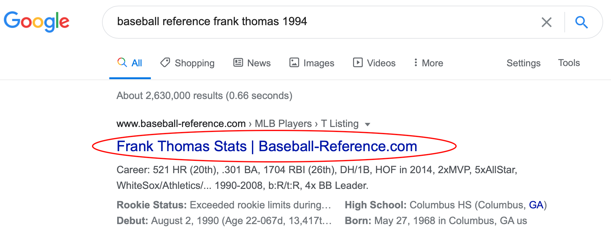
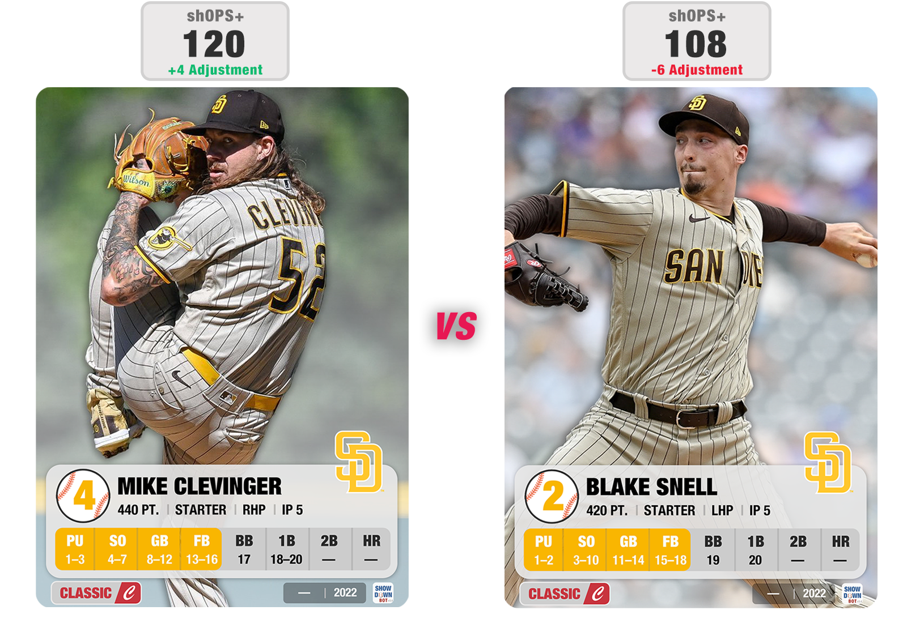
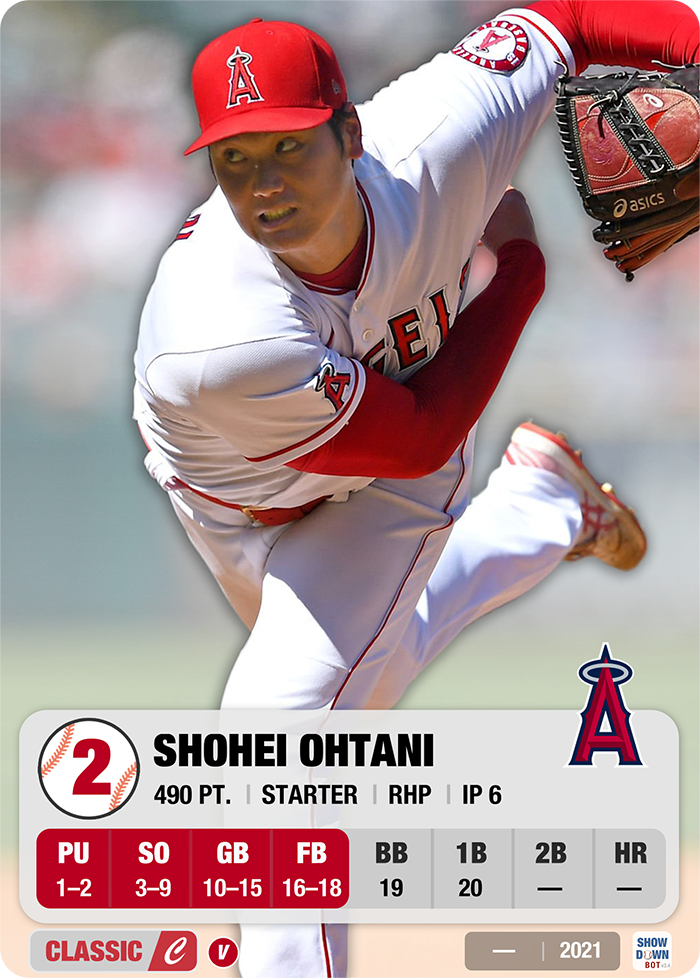
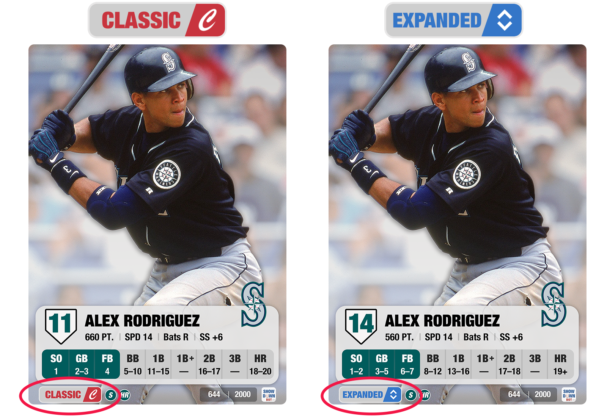

# Showdown Bot

[Showdown Bot](https://showdownbot.com) is the simplest way of creating custom MLB Showdown cards. Simply enter a player's **name**, **season**, and **image**. The Showdown Bot takes care of the rest. 


----


## Table of Contents
* [Getting Started](#getting-started)
    * [Prerequisites](#prerequisites)
    * [Installation](#installation)
* [How it Works](#how-it-works)
    * [Player Identification](#player-identification)
    * [Gather Player Data](#gather-player-data)
    * [Overrides](#overrides)
    * [Convert to MLB Showdown Card](#convert-to-mlb-showdown-card)
* [Card Methodology](#card-methodology)
    * [Creating a Chart](#creating-a-chart)
    * [Defense](#defense)
    * [Innings Pitched](#innings-pitched)
    * [Speed](#speed)
    * [Icons](#icons)
    * [Points](#points)
    * [Multi-Year Cards](#multi-year-cards)
    * [Negro Leagues and Pre-20th Century](#negro-leagues-and-pre-20th-century)
    * [shOPS+](#shops)
    * [2022 Sets](#2022-sets)
* [Showdown Library](#showdown-library)
* [Showdown Explorer](#showdown-explorer)
* [Running Locally](#running-locally)
* [Contact the Dev](#contact-the-dev)

----

## Getting Started

### Prerequisites
* [Python3](https://www.python.org/downloads/)

* (Optional) [pyenv](https://github.com/pyenv/pyenv) or [virtualenv](https://virtualenv.pypa.io/en/latest/)

### Installation

MLB Showdown Bot is available on PyPi

```sh
pip install mlb-showdown-bot
```

MLB Showdown Bot can be run directly from the CLI

```sh
showdownbot --name "Mike Piazza" --year 1997 --context 2001
```

Example Python use:

```python
from mlb_showdown_bot.showdown_player_card_generator import ShowdownPlayerCardGenerator
from mlb_showdown_bot.baseball_ref_scraper import BaseballReferenceScraper

name = 'Mike Piazza'
year = '1997'

# GET PLAYER DATA
scraper = BaseballReferenceScraper(name=name,year=year)
statline = scraper.player_statline()

# CREATE SHOWDOWN CARD 
showdown = ShowdownPlayerCardGenerator(
    name=name,
    year=year,
    stats=statline,
    context='2001',
    print_to_cli=True
)

# CREATE SHOWDOWN CARD IMAGE
showdown.player_image(show=True)
```

----


## How it Works

### Player Identification

At minimum, the bot takes a player's NAME and SEASON as inputs. The first step is identifying which player the user is trying to create a card for. 

Included in the Bot's files is a mapping of Player Name (ex: Jacob DeGrom) -> Baseball Reference Id (ex: degroja01). The Bot will use this mapping if the entered name matches ONE player in the mapping file.

Because there have been around 20,000 unique players in the history of the MLB, there are cases of multiple players sharing the same name (ex: Frank Thomas _(1951-1966)_ and Frank Thomas _(1990-2008)_).

To solve for this, the bot first searches the phrase **"baseball reference {name} {year}"**. (Ex: "baseball reference frank thomas 1994"). Using Google's indexing algorithm, the bot chooses the first search result and derives the player's unique baseball reference id from it. 



### Gather Player Data

The bot uses [Baseball Reference](https://www.baseball-reference.com) as it's source for player data. Baseball Reference stores statistics for all of the ~20,000 players to make an appearance in the big leagues. 

Stats are extracted from the the baseball reference page for the player id selected in the previous step. Stats like batting average, home runs, and defensive metrics (tzr/drs) are extracted only for the chosen season(s). For pitchers, opponent batting results are used (ex: batting average against). 

Some of this player data is unavailable for certain years or timeframes. Below is a list of unsupported time periods:
1. Postseason (no batting against data)
2. Minor Leagues (no batting against data)
3. Spring Training (no batting against data)

If the selected season occured after 2015, sprint speed is also extracted from [Baseball Savant](https://baseballsavant.mlb.com/sprint_speed_leaderboard). A player's average sprint speed is used to determine in-game SPEED.

### Overrides

Overrides give additional ways to customize a player's card. They are applied by adding text after the player's name. These are the available overrides:

- **(PITCHER)**: Type override to use a player's pitching stats. Can be applied to create proper 2-way players (ex: Shohei Ohtani (Pitcher)) or create pitching cards for position players (ex: Anthony Rizzo (Pitcher)).
- **(HITTER)**: Type override to use a player's hitting stats. Can be applied to create proper 2-way players (ex: Michael Lorenzen (Hitter)) or create hitting cards for position players (ex: Mike Hampton (Hitter)).
- **({TEAM_ID})**: Override to only use stats for a specific team. Can be used to create partial year cards for players that switched teams mid-season! (ex: Manny Ramirez (LAD)). Team Ids are found on the player's baseball reference page in the "Tm" column. Limited to seasons after 1918 and does not apply to multi-year or career long cards.

### Convert to MLB Showdown Card

The stats scraped in the previous step are used as inputs to determine the player's MLB Showdown card for the selected season. The player's in-game abilities are derived using the probability of outcome for each result on an MLB Showdown chart. More about that process is detailed below in the [Card Methodology](#card-methodology) section.

To create the card image, the [Pillow](https://pillow.readthedocs.io/en/stable/) library is leveraged to dynamically create the final jpg. The user can add optional enhancements like selecting an image and adding _Super Season_ or _Cooperstown Collection_ graphics.

----


## Card Methodology


### Creating a Chart

##### _**NOTE: A player's ONBASE (hitter) or CONTROL (pitcher) are referred to in this repository as COMMAND**._ 

The following steps are used to select the most accurate MLB Showdown card stats for a player:

1. Calculate **Onbase Pct** for each possible **Command/Out** combination.
2. Produce a chart for each **Command/Out** combination using the player's real life statline.
3. Choose the most accurate chart + **Command/Out** combination by comparing projected Showdown statline to real life statline for that set's weight categories (ex: OBP, SLG)

Each of these steps work by a using baseline opponent to project in-game outcomes. A baseline opponent represents the approximate average pitcher or hitter a player would face in-game. The baseline stats are represented by a dictionary that includes **Command**, **Outs**, and number of chart results for each category (SO, BB, HR, etc). Baseline opponents differ for each MLB Showdown set. 


###### _Example baseline pitcher for 2001 set. **Note that all weight categories may not add up to 20 perfectly._
    
    '2001': {
        'command': 3.0,
        'outs': 16.0,
        'so': 4.1,
        'bb': 1.35,
        '1b': 2.0,
        '2b': 0.62,
        '3b': 0.00,
        'hr': 0.11
    }

These baseline opponents are vital to determining the final output of the player card. Adjusting these values will change which chart the bot decides is the most accurate. Because the actual baselines used to create the original sets are unknown, these are estimations based on set averages and testing against WOTC cards. The goal is to find the baseline weights that most closely resemble the original sets from 2000-2005.

### **Command/Out --> Onbase Pct**

For each set, a static list of possible **Command/Out** combinations is defined for each player type (Hitter, Pitcher) in the [showdown constants](https://github.com/mgula57/mlb_showdown_card_bot/blob/master/mlb_showdown/showdown_constants.py) file. This list is used to generate the expected **Onbase Pct** for each combination using the baseline described above as the opponent. The following formula is used: 

`P(My Advantage) * P(Walk Or Hit on My Chart) + P(Opponent Advantage) * P(Walk Or Hit on Opponent's Chart)`

Only a few **Command/Out** combinations that are closest to the player's real life onbase pct are further processed. This is for efficiency and greater accuracy. 

### Generating Player Chart

Now that a list of the most accurate **Command/Out** combinations (in terms of onbase pct) has been generated, a player's full in-game chart can be produced for each combination.

A player's chart is generated by populating each result category.

* Pitcher: _(PU, SO, GB, FB, BB, 1B, 2B, HR)_
* Hitters: _(SO, GB, FB, BB, 1B, 1B+, 2B, 3B, HR)_

The number of results (out of 20 slots) assigned to each category are calculated using this formula:

`(category_real_life_results_per_400_pa - (baseline_opponent_advantages_per_20_rolls * baseline_opponent_category_results)) / my_advantages_per_20_rolls`

**Important caveats:** 

* Stats are normalized to 400 Plate Appearances to mirror the 400 possible showdown roll combinations (_20 (Pitch Roll) * 20 (Swing Roll)_).
* FB, GB, PU are limited to OUT constraints. They use a different formula involving **Ground/Air Out Ratio** and **Infield FB Pct**.
* 1B+ is determined by dividing stolen bases per 400 PA by a weighting determined by the player's Onbase. This yields higher 1B+ chart slots for player's with a lower Onbase. For example lets say Player A had 30 steals per 400PA and an Onbase of 6, while Player B had 30 steals per 400PA and an Onbase of 9. Player A will have more 1B+ on his card, as he gets the advantage less.
* 1B is filled with the slots remaining after all other categories are populated.
* The Maximum BB on a hitter's chart is 13 (thanks Barry Bonds '04).
* The maximum HR on a hitter's chart is 10.

### Selecting Most Accurate Chart

Now that a chart has been generated for each **Command/Out** combination, the bot has all the required datapoints needed to determine accuracy. 

The player's **Command** and chart values are used to estimate the player's _in-game_ statline for 400 Plate Appearances. That statline is then compared to the player's _real life_ statline per 400 Plate Appearances. Some stat categories are given more weight than others (ex: _OBP_ accuracy is weighted more heavily than _SLG_ accuracy). _Both real and in-game statlines are displayed in website and CLI outputs._

**The chart with the highest aggregate accuracy is chosen as the final chart returned by the bot.**

To display one of the other chart outputs, add the optional **offset**/ argument on the CLI or the **Stats Version** option on the website. It allows the user to use any of the other charts from the Top 5 most accurate list. Use the `--offset` argument if in the CLI or choose an **Stats Version** > 1 in the _Stats Version_ section of the website.

### **Defense**

#### _Hitters_
Each player can have a maximum of **2 positions** or WOTC sets (2000-2005). That is expanded to **3 positions** for 2022 sets. For a position to qualify, the player has to make at least **7 appearances** or at least **15%** of games at that position. The positions are then limited to the top by number of appearances. 

In-game defensive ratings are calculated based on either Outs Above Avg (OAA), Total Zone Rating (tzr), Defensive Runs Saved (drs), or Defensive Wins Above Replacement (dWAR). The bot will choose which metric to use depending on the year:

- 1870-1953: dWAR
- 1953-2002: TZR
- 2003-2015: DRS
- 2016-PRES: OAA (EXCEPT CATCHERS)

All these metrics work by comparing a certain player to the average replacement at that position (0). For example a +10 TZR is an above average rating, while a -7 TZR is below average.

The player's in-game rating is calculated with a percentile within a range. The player's in-game rating is calculated based on that percentile multiplied by the highest rating for each position (Ex: **3B: +4**, **SS: +5**, **LF/RF: +2**).

Ex: David Wright 2007 (+12 DRS)
```
* 3B Rating = Percentile * 3B In-Game Max  
* 3B Rating = 0.8 * 4
* 3B Rating = 3.2
* 3B Rating = +3
```

For multi-year cards, the bot will take an average or median depending on which metric is used. Below is the breakdown for each metric.

- dWAR - MEDIAN
- TZR - MEDIAN
- DRS - MEDIAN
- OAA - AVG PER 162 GAMES AT POSITION

If the multi-year card spans across available metrics (ex: a card using 2014-2022), it will use the metric available for the entire period.

#### _Pitchers_
Pitchers fall under the following categories
1. STARTER: >40% of pitcher's appearances were starts
2. RELIEVER: <=40 % of pitcher's appearances were in relief
3. CLOSER: pitcher had at least 10 saves

### **Speed**

In-game SPEED is calculated differently depending on the year. 
* If the year is AFTER 2015, SPRINT SPEED is used. _(Sourced from Baseball Savant)_
* If the year is BEFORE or ON 2015, STOLEN BASES (per 650 PA) is used.

Either SPRINT SPEED or STOLEN BASES is then converted to a percentile based off a range (the same way that defense is calculated). That percentile is then multiplied by the maximum in-game speed.

For example, the range of SPRINT SPEED is from 23 ft/sec to 31 ft/sec. If a player's SPRINT SPEED was 27ft/sec, they are in the 50th percentile (0.5). If the maximum in-game speed was 25, then this player's in-game SPEED is equal to 25 * 0.5, which rounds to **13**.


_** Pitchers are automatically given a SPEED of 10._

### **Innings Pitched**

Innings pitched is calculated based a Pitcher's innings pitched / games played (IP/G). The components of that equation will change depending on the pitcher's type (STARTER vs RELIEVER). 

- STARTER: IP/GS
- RELIEVER: (IP - (GS * IP/GS)) / (G-GS)

Ex: Nestor Cortes (2021) (RELIEVER)
```
Stats:
    G: 39
    GS: 12
    IP/GS: 5.5
    IP: 123.2

IP = (IP - (GS * IP/GS)) / (G-GS)
   = (123.67 - (12 * 5.5)) / (39-12)
   = 57.67 / 27
   = 2.09
   = 2 IP
```
### **Icons**

Icons were a feature introduced in 2003 MLB Showdown sets. 

This is the list of available icons and how a player is eligible:

_** Some of these thresholds are slightly different than the original game._

* **SS**: Won Silver Slugger Award.
* **GG**: Won Gold Glove Award.
* **V**: Won AL or NL Most Valuable Player Award.
* **CY**: Won AL or NL CY Young Award.
* **R**: Selected season was player's first year in MLB.
* **RY**: Won AL or NL Rookie of the Year Award.
* **20**: Won 20 or more games as a Pitcher.
* **K**: Struck out at least 215 batters.
* **HR**: Hit at least 40 Home Runs or led either league in Home Runs.
* **SB**: Stole at least 40 bases or led either league in Steals.
* **RP**: Led AL or NL in Saves.

### **Points**

A player's point value is calculated by summing up a player's value provided in the following categories:

_Hitters_
* Onbase Pct
* Batting Avg
* Slugging Pct
* Defense
* Speed
* Home Runs
* Icons (03+)

_Pitchers_
* Onbase Pct Against
* Batting Avg Against
* Slugging Pct Against
* Innings Pitched
* Icons (03+)
* CLOSER Bonus (00 ONLY)

A player's point value in each category is calculated by multiplying the WEIGHT given to the category by the PERCENTILE the player placed in. 

The WEIGHT is the number of points provided if the player achieves the 100th percentile in that category. The percentile is calculated by taking difference between the player's stat and minimum values for a category, and dividing it by the difference between maximum and minimum values assigned to the category. The WEIGHT represents how many points a player will receive if they are in the 100th percentile in the category. _NOTE: WEIGHTS change across sets._

This calculation is performed for each category. The categorical point values are summed into the player's final total point value. 

Ex: **Larry Walker, 550 PTS** _(2003 Base Set)_
```
Statline:
    BA: .348
    OBP: .419
    SLG: .608

    PA: 553
    1B: 104
    2B: 33
    3B: 1
    HR: 29 (34.5 per 650 PAs)
    BB: 68
    SO: 67

    SPD: SPEED C (11)
    ICONS: G

Points (OBP) = WEIGHT * PERCENTILE
             = 160 * (0.419 - 0.270) / (0.425 - 0.270)
             = 160 * 0.96
             = 154 pts.
Points (SLG) = WEIGHT * PERCENTILE
             = 160 * 1.29
             = 206 pts.
Points (BA)  = WEIGHT * PERCENTILE
             = 50 * 1.37
             = 68.5 pts.
Points (HR)  = WEIGHT * PERCENTILE
             = 60 * 0.98
             = 59 pts.
Points (SPD) = WEIGHT * PERCENTILE
             = 55 * 0.10
             = 5.5 pts.
Points (DEF) = WEIGHT * PERCENTILE
             = 45 * 1.00
             = 45 pts.
Points (G Icon) = WEIGHT
                = 10 pts.

Points (Total) = Round(154 + 206 + 68.5 + 59 + 5.5 + 45 + 10)
               = 550

```
##### _Note: Pitchers have some categories (ex: BAA) where is percentile is reversed (1-percentile)_

There are additional weights/logic applied across the different sets to try to match to the original WOTC sets. 

- **Allow Negatives**: If True, allows a player to be penalized in the negative for a bad category. For example if a player is under the threshold defined for OBP, they will receive negative PTS for OBP. If False, player gets +0 PTS for that category if below threshold.
- **Normalize Towards Median**: If True, a player over a certain value will get overall points reduced in order to keep a "Bell Curve" of point distribution. Scaler increases as point value above set value increases.
- **Positional Defense Weights**: In some sets, certain positions are weighted lower than others. For example in the 2003 set, LF/RF max defense (+2) is worth 25% less than max CF defense (+3)
- **Command Outs Adjustment**: In some sets, certain Command - Out combinations receive a manual adjustment to closer match WOTC. These are often small adjustments (1-5%) that only are applied to slashline and HR point categories. These help balance out points for cards that work better for stategy and advanced play.

### **Multi-Year Cards**

Multi-year or career long cards can be created on Showdown Bot using the year input. Here are some examples:

- 2005-2010
- 2005+2007+2010+2013
- CAREER

Card methodology will slightly change if the user enters a multi-year card. Differences include:

- **SPEED**: Speed rating is based on the avg across the selected years. If the card crosses between using SB and Sprint Speed as metrics, it will use Sprint Speed if 35% of the seasons choosen are after 2015. Otherwise it will use SB as the benchmark.
- **TEAM**: If the choosen player played for multiple teams, the Bot will assign the team with the most games played.
- **DEFENSE**: For each qualified position, the Bot uses the **median** defensive metric (drs/tzr/dWar) calculated across the choosen years. If outs above avg is available, it takes uses 162 game average instead of a median. The qualification for positions increases from 15% -> 25%.
- **GB/FB**: The GO/AO ratio is averaged across choosen years.
- **Icons**: If the player qualified for an icon in any of the choosen seasons, he is granted the icon in the multi-year variant. This is excluding the R icon, which is only available in single-year cards.

### **Negro Leagues and Pre-20th Century**

As of the 3.0 update, Showdown Bot now supports all players from Baseball Reference, including the Negro Leagues and pitchers from the 19th century. Data for these players is not fully available, so the Bot does it's best to fill in gaps through estimation. Any estimation will show a **'*'** next to the category in the breakdown section.

Here are the stats that the Bot will estimate if unavailable:

Pitchers
- PA: Uses BF if available, otherwise predicts PA based on IP * 4.25 (represents a league avg)
- 2B: Predicts 2B based on player's ERA percentile (1.0-5.0). Max value is 25% of total hits allowed.
- 3B: Predicts 2B based on player's ERA percentile (1.0-5.0). Max value is 2.5% of total hits allowed.
- SLG: Derived from 2B and 3B estimations from above.
- OBP: Derived using PA estimation from above as denominator.
- RATIO: Estimates GO/AO ratio based on estimated SLG (higher the SLG, more FB on chart)

Hitters
- SB: Will use SPEED 12 if SB not available.

### **shOPS+**

shOPS+ takes a player's projected in-game OPS and normalizes it across the entire set in that year (26 players/team). It adjusts a player's OPS slightly to account for a typical Showdown manager's tendency to draft higher Onbase/Control cards. A score of 100 is league average, and 175 is 75% better than the league average.

For example, Yandy Diaz's **2022 CLASSIC** card (10 Onbase) had a projected .838 OPS, which was 48% better than the 2022 MLB average after being adjusted to account for higher control pitching. As a result, his shOPS+ was 148.


**Calculation:**

##### _Note: Numerator and deominator are flipped for pitchers._
```
((PLAYER_PROJ_OBP / LEAGUE_AVG_PROJ_OBP) + (PLAYER_PROJ_SLG * COMMAND_ADJUSTMENT_FACTOR / LEAGUE_AVG_PROJ_SLG) - 1) x 100
```

**How does the Command Adjustment work?**

The `Command Adjustment Factor` is a way for shOPS+ to account for normal Showdown draft tendencies. Managers tend to weight gaining the advantage over number of outs on their player's chart. One player's stats against the "avg" player in a set may not match the typical card drafted in a real Showdown draft setting.

For example, let's compare **Mike Clevinger** vs **Blake Snell** in the **2022-CLASSIC** set.



These 2 cards have very similar projected OPS against (Clevinger having the slight edge at .622 vs Snell's .625), meaning their non-adjusted shOPS+ numbers are similar (Clevinger at 116, Snell at 114).

Most Showdown managers however would see a larger difference between these 2 cards, as Mike Clevinger's +4 Control performs significantly better against higher Onbase opponents, especially with no 2B on his chart. shOPS+ accounts for that, applying a **1.04** adjustment factor to Clevinger's SLG and a **0.94** to Snell. This results in a larger disparity between the 2 pitchers, with Clevinger ending with a 120 shOPS+ vs Snell's 108.

## **2022 Sets**

 **Showdown Bot now includes new sets that modernize the look and play of MLB Showdown!**


### **Design**

The 2022 set design takes elements from classic MLB Showdown sets and adds a modern twist, resulting in a streamlined design that will look great with any background image. Chart and Command colors will change from team to team, creating a blend of 2000/2001's color with 2004/2005's simplicity.





### **Styles**

These sets are split between **Classic** and **Expanded** styles, with the goal of offering modern cards to every type of Showdown fan. The Classic style is most compatible with 2000/2001 sets, while Expanded fits with 2002-2005 sets. You will see a visual indicator of the card style in the bottom left of each card.



### **Classic Style**

The Classic Style is made for the OG Showdown fan who prefers the 2000/2001 sets. In this style, hitters have lower Onbase numbers (between 4-12) but better charts. It uses the 2001 set as a starting point, but alters the original formula to fix gaps while maintaining compatibility.

Changes from 2001 set:
- **SPEED**: Expands options from 10/15/20 to the full range of 8-25.
- **HITTING**: The formula has been tweaked to account for the shift in balance between hitter and pitcher. Hitter charts will be slightly better than in the 2001 set to due to better Pitcher opponents!
- **ICONS**: Icons will appear on the card. Players can optionally incorporate them into gameplay or simply have them as a visual representation of awards and rookie status.
- **PITCHER CHART HRS**: To account for an increase in HRs, the minimum requirement for HR on a pitcher's chart has decreased, resulting in more HR results.
- **MORE COMMAND-OUT COMBINATIONS**: In order to increase variety and accuracy of cards, more possible Onbase/Control + Out combinations have been added. For example it is possible to have a 4 Control pitcher with 19 outs, or a 9 Onbase hitter with 6 Outs. This will help increase balance of low onbase and high SLG hitters (ex: Javy Baez), who under normal Showdown constraints were constrained to lower Onbase numbers.
- **STRIKEOUTS**: The number of strikeouts on a hitters chart should slightly decrease, with the assumption that pitcher charts will have more SO results than in 2000-2001.
- **DEFENSIVE RANGES**: Certain positions will see an increase in AVG in-game defense. This includes SS, CF, and 3B. Ex: 2018 Francisco Lindor goes from +5 SS in 2001 set to +7 SS in 2022 set. It also allows for negative defense across all positions (ex: Matt Kemp 2010).
- **NUMBER OF POSITIONS**: Now a player has a maximum of 3 available positions. This provides more value to super utility players like Ben Zobrist and Kris Bryant.

### **Expanded Style**

The Expanded Style is made for the new school Showdown fan who prefers the 2002-2005 sets. In this style, hitters have higher Onbase numbers (between 7-16) but less impactful charts. Charts also expand past 20, creating possible results outside of the normal 1-20 range. It uses the 2005 set as a starting point, but alters the original formula to fix gaps while maintaining compatibility.

Changes from 2005 set:
- **SPEED**: Reduces maximum speed to 25, helping reduce automatic steals and advances from players like Lou Brock and Rickey Henderson.
- **HITTING**: The formula has been tweaked to account for the shift in balance between hitter and pitcher. Hitter charts will be slightly better than in the 2005 set to due to better Pitcher opponents!
- **PITCHER CHART HRS**: To account for an increase in HRs, the minimum requirement for HR on a pitcher's chart has decreased, resulting in more HR results.
- **MORE COMMAND-OUT COMBINATIONS**: In order to increase variety and accuracy of cards, more possible Onbase/Control + Out combinations have been added. For example it is possible to have a 4 Control pitcher with 19 outs, or a 10 Onbase hitter with 8 Outs. This will help increase balance of low onbase and high SLG hitters (ex: Javy Baez), who under normal Showdown constraints were constrained to lower Onbase numbers.
- **STRIKEOUTS**: The number of strikeouts on a hitters chart should slightly decrease, with the assumption that pitcher charts will have more SO results than in 2002-2005.
- **DEFENSIVE RANGES**: Certain positions will see an increase in AVG in-game defense. This includes SS, CF, and 3B. Ex: 2021 Francisco Lindor goes from +3 SS in 2005 set to +4 SS in 2022 set. It also allows for negative defense across all positions (ex: Matt Kemp 2010).
- **NUMBER OF POSITIONS**: Now a player has a maximum of 3 available positions. This provides more value to super utility players like Ben Zobrist and Kris Bryant.

### **Dark Mode**

There is now an additional option for **Dark Mode**, available on 2022 Classic and Expanded sets only. Works with any player!


## Showdown Library 

The Showdown Library is a backend system used to: 
1. Store historical data. 
2. Allow Showdown fans access to cards more efficiently.
3. Power advanced features.
4. Centralize Showdown Bot data into one location.
5. Enable Official Showdown Bot Set Releases.

It leverages the combination of Firebase's Realtime Database and the Google Drive API to deliver realtime Showdown Cards without the need for on-demand processing. 

When a user submits a card on Showdown Bot, it will check to see if the user requested card is stored in the database, and if so will return the card and corresponding image in less than a second.

There are some cases in which the Bot will leverage the data from Showdown Library, but will still need to generate an image live. 

List of reasons it will not used pre-stored image:
- No automated image exists.
- Non V1 Card.
- Custom set number
- Has special edition (ex: CC, SS, RS)
- Expansion does not match (ex: TD, PR)
- Has variable speed ('00-'01 Only)
- Is a Foil
- Img Link was provided by the user
- Img Upload was provided by the user

----
## Showdown Explorer

The Showdown Explorer tool leverages the power of the Showdown Library to provide the user with the ability to discover and explore cards from 1900-2022.

_In depth walkthroughs and guides will be linked here in a future update._

----
## Running Locally

You can [clone](https://docs.github.com/en/repositories/creating-and-managing-repositories/cloning-a-repository) this repository and run it locally on your machine. Be sure you have went through the [prerequisites](#prerequisites) before proceeding.

Here are the high level steps:

1. [Clone](https://docs.github.com/en/repositories/creating-and-managing-repositories/cloning-a-repository) this repository to your local machine
2. Open Terminal (MacOS) or Windows CLI
3. Change the current working directory to the location where you cloned in step 1.
4. Create a new [virtual environment](https://virtualenv.pypa.io/en/latest/) (optional)
5. Install required package dependencies ([instructions](https://stackoverflow.com/questions/7225900/how-can-i-install-packages-using-pip-according-to-the-requirements-txt-file-from))

After installing and handling any package errors, you can run Showdown Bot from the command line or locally in a browser.

Command Line
```
python mlb_showdown_bot --name "Mike Piazza" --year 1997 --context 2001
```

Flask App (opened via Browser)
```
python app.py
```

----
## Contact the Dev

You can reach out to the developer of MLB Showdown Bot through email mlbshowdownbot@gmail.com

Follow MLB Showdown Bot Twitter for updates and card posts!

[](https://twitter.com/mlbshowdownbot)