# Showdown Bot

[Showdown Bot](https://showdownbot.com) is the simplest way of creating custom MLB Showdown cards. Simply enter a player's **name**, **season**, and **image**. The Showdown Bot takes care of the rest. 

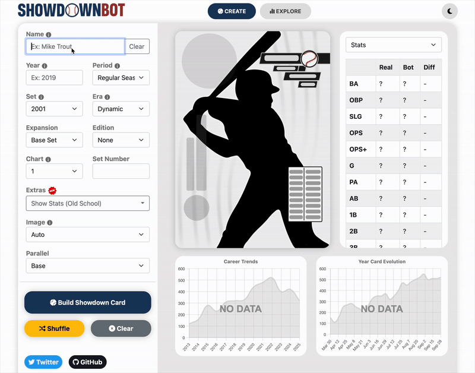

----


## Table of Contents
* [Getting Started](#getting-started)
    * [Prerequisites](#prerequisites)
    * [Installation](#installation)
* [How it Works](#how-it-works)
    * [Player Identification](#player-identification)
    * [Gather Player Data](#gather-player-data)
    * [Overrides](#overrides)
    * [Convert to MLB Showdown Card](#convert-to-mlb-showdown-card)
* [Card Methodology](#card-methodology)
    * [Creating a Chart](#creating-a-chart)
    * [Defense](#defense)
    * [Innings Pitched](#innings-pitched)
    * [Speed](#speed)
    * [Icons](#icons)
    * [Points](#points)
    * [Multi-Year Cards](#multi-year-cards)
    * [Eras](#eras)
    * [Negro Leagues and Pre-20th Century](#negro-leagues-and-pre-20th-century)
    * [shOPS+](#shops)
* [Editions](#editions)
    * [Cooperstown Collection](#cooperstown-collection)
    * [Super Season](#super-season)
    * [Nationality](#nationality)
    * [All-Star Game](#all-star-game)
    * [Rookie Season](#rookie-season)
    * [Holiday](#holiday)
    * [Postseason](#postseason)
* [New Sets](#new-sets)
* [Parallels](#parallels)
* [Period](#period)
    * [Regular Season](#regular-season)
    * [Postseason](#postseason)
    * [Date Range](#date-range)
    * [Split](#split)
* [More Options](#more-options)
    * [Border](#border)
    * [Dark Mode](#dark-mode)
    * [Year Text](#year-text)
    * [Set Year +1](#set-year-+1)
    * [Remove Team Branding](#remove-team-branding)
    * [Use Secondary Team Color](#use-secondary-team-color)
    * [Nicknames](#nicknames)
    * [Variable Speed](#variable-speed)
* [Uploading Custom Images](#uploading-custom-images)
* [Showdown Library](#showdown-library)
* [Showdown Explorer](#showdown-explorer)
* [Running Locally](#running-locally)
* [Contact the Dev](#contact-the-dev)

----

## Getting Started

### Prerequisites
* [Python3](https://www.python.org/downloads/)

* (Optional) [pyenv](https://github.com/pyenv/pyenv) or [virtualenv](https://virtualenv.pypa.io/en/latest/)

### Installation

MLB Showdown Bot is available on PyPi

```sh
pip install mlb-showdown-bot
```

MLB Showdown Bot can be run directly from the CLI

```sh
showdownbot --name "Mike Piazza" --year 1997 --context 2001
```

Example Python use:

```python
from mlb_showdown_bot.showdown_player_card import ShowdownPlayerCard
from mlb_showdown_bot.baseball_ref_scraper import BaseballReferenceScraper

name = 'Mike Piazza'
year = '1997'
set = '2001'

# GET PLAYER DATA
scraper = BaseballReferenceScraper(name=name,year=year)
statline = scraper.player_statline()

# CREATE SHOWDOWN CARD 
showdown = ShowdownPlayerCard(
    name=name,
    year=year,
    stats=statline,
    set=set,
    print_to_cli=True
)

# CREATE SHOWDOWN CARD IMAGE
showdown.card_image(show=True)
```

----


## How it Works

### Player Identification

At minimum, the bot takes a player's NAME and SEASON as inputs. The first step is identifying which player the user is trying to create a card for. 

Included in the Bot's files is a mapping of Player Name (ex: Jacob DeGrom) -> Baseball Reference Id (ex: degroja01) and their years played. The Bot will use this mapping to try to find the closest name/year match.

If there is no match, the bot searches the phrase **"baseball reference {name} {year}"**. (Ex: "RM-"). Using Bing's indexing algorithm, the bot chooses the first search result and derives the player's unique baseball reference id from it. 

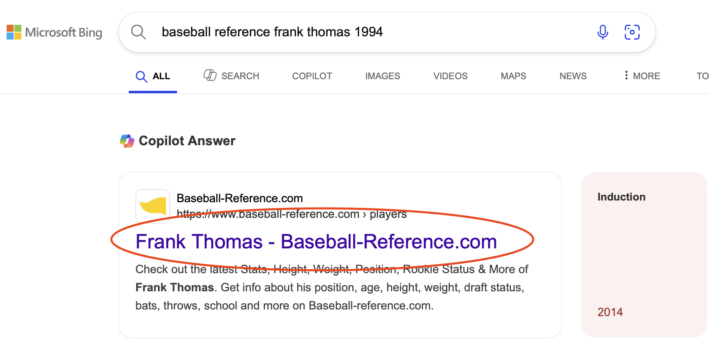

_**TIP:** If the Bot throws an error for a player/year combination you know to be valid, try entering their baseball reference player ID (ex: degroja01) as the name._

### Gather Player Data

The bot uses [Baseball Reference](https://www.baseball-reference.com) as it's source for player data. Baseball Reference stores statistics for all of the ~20,000 players to make an appearance in the big leagues. 

Stats are extracted from the the baseball reference page for the player id selected in the previous step. Stats like batting average, home runs, and defensive metrics (tzr/drs) are extracted only for the chosen season(s). For pitchers, opponent batting results are used (ex: batting average against). 

Some of this player data is unavailable for certain years or timeframes. Below is a list of unsupported time periods:
1. Minor Leagues (no batting against data)
2. Spring Training (no batting against data)
3. Foreign Leagues (ex: NPB)

If the selected season occured after 2015, sprint speed and outs above avg are also extracted from [Baseball Savant](https://baseballsavant.mlb.com/sprint_speed_leaderboard).

### Overrides

Overrides give additional ways to customize a player's card. They are applied by adding text after the player's name. These are the available overrides:

- **(PITCHER)**: Type override to use a player's pitching stats. Can be applied to create proper 2-way players (ex: Shohei Ohtani (Pitcher)) or create pitching cards for position players (ex: Anthony Rizzo (Pitcher)).
- **(HITTER)**: Type override to use a player's hitting stats. Can be applied to create proper 2-way players (ex: Michael Lorenzen (Hitter)) or create hitting cards for position players (ex: Mike Hampton (Hitter)).
- **({TEAM_ID})**: Override to only use stats for a specific team. Can be used to create partial year cards for players that switched teams mid-season! (ex: Manny Ramirez (LAD)). Team Ids are found on the player's baseball reference page in the "Tm" column. Limited to seasons after 1918 and does not apply to multi-year or career long cards.

### Convert to MLB Showdown Card

The stats scraped in the previous step are used as inputs to determine the player's MLB Showdown card for the selected season. The player's in-game abilities are derived using the probability of outcome for each result on an MLB Showdown chart. More about that process is detailed below in the [Card Methodology](#card-methodology) section.

To create the card image, the [Pillow](https://pillow.readthedocs.io/en/stable/) library is leveraged to dynamically create the final image. The user can add optional enhancements like selecting an image and adding graphics like Special Editions (ex: Super Season, Cooperstown Collection) and image parallels.

----


## Card Methodology


### Creating a Chart

##### _**NOTE: A player's ONBASE (hitter) or CONTROL (pitcher) are referred to in this repository as COMMAND**._ 

The following steps are used to select the most accurate MLB Showdown card stats for a player:

1. Produce a chart for each of the chosen set's **Command** possibilities using the player's real life statline. Each command is executed twice, with outs being adjusted up or down 1 on the second run.
2. Choose the most accurate chart by comparing projected Showdown statline to real life statline for that set's weight categories. Categories usually include OBP, SLG, and OPS.

Each of these steps work by a using baseline opponent to project in-game outcomes. A baseline opponent represents the approximate average pitcher or hitter a player would face in-game. The baseline stats are represented by a dictionary that includes **Command**, **Outs**, and number of chart results for each category (SO, BB, HR, etc). Baseline opponents differ for each MLB Showdown set. 


###### _Example baseline pitcher for 2001 set. This would be used to calculate a pitcher's chart._
    
    Chart(
        is_baseline = True,
        set='2001',
        command=7.10,
        values={
            'PU': 0.00,
            'SO': 0.85,
            'GB': 1.12,
            'FB': 1.15,
            'BB': 5.10,
            '1B': 7.83,
            '2B': 1.60,
            '3B': 0.25,
            'HR': 2.10,
        }
    )

These baseline opponents are vital to determining the final output of the player card. Adjusting these values will change which chart the bot decides is the most accurate. Because the actual baselines used to create the original sets are unknown, these are estimations based on set averages and testing against WOTC cards. The goal is to find the baseline weights that most closely resemble the original sets from 2000-2005.

#### Changing Baselines Across Eras

These baselines are also dynamically adjusted when a card is created outside of the original WOTC era. This is done by comparing the MLB averages during the original set's year vs the card's year. 

For example when trying to create an Aaron Judge 2024 card in the 2001 style, the baseline opponent pitcher be adjusted to have better stats than the original from 2000 due to pitching being better in 2024 compared to 2000. This means Aaron Judge's card will be be better in order to match his real statline now that his opponent is better.

### Generating Player Chart

A player's chart is generated by populating each result category.

* Pitcher: _(PU, SO, GB, FB, BB, 1B, 2B, HR)_
* Hitters: _(SO, GB, FB, BB, 1B, 1B+, 2B, 3B, HR)_

The number of results (out of 20 slots) assigned to each category are calculated using this formula:

`(category_real_life_results_per_400_pa - (baseline_opponent_advantages_per_20_rolls * baseline_opponent_category_results)) / my_advantages_per_20_rolls`

**Important caveats:** 

* Stats are normalized to 400 Plate Appearances to mirror the 400 possible showdown roll combinations (_20 (Pitch Roll) * 20 (Swing Roll)_).
* In some sets, SO/GB/FB will use a percent based fill method rather than rate based. This applies to 2003+ hitters and 2000/2001/CLASSIC pitchers. For sets using a rate based methodology, PU/GB/FB actuals are estimated by using IF/FB and GO/AO.
* 1B+ is determined by dividing stolen bases per 400 PA by a weighting determined by the player's Onbase. This yields higher 1B+ chart slots for player's with a lower Onbase. For example lets say Player A had 30 steals per 400PA and an Onbase of 6, while Player B had 30 steals per 400PA and an Onbase of 9. Player A will have more 1B+ on his card, as he gets the advantage less.
* By default the bot uses traditional rounding if the projected number of chart results is in between 2 numbers. Some sets and chart categories alter the cutoff for rounding. For example 2000, 2001, and CLASSIC pitcher home runs are rounded up at 0.425 instead of 0.5.
* The Bot will check if rounding has caused it to underrate the hitter/pitchers OBP and SLG. If so, it will identify the SLG category (2B, 3B, HR) that is least accurate and adds +1 chart results to it. 1B has one result subtracted from it to account for this. Here is how a chart is eligible for an adjustment.
  * Projected SLG < Real SLG
  * Projected OPS < Real OPS
  * Projected SLG vs Real SLG Difference > 1%
  * Projected OBP vs Real OBP Difference < 3%
   

#### Expanded Sets

For Expanded sets the formula is slightly adjusted to account for results > 20. A **sub-21 slot value** is calculated in order to dictate what each slot between 1-20 is worth. The purpose is to be able to assign a probability to results over 21+ for projection purposes caused by the use of strategy cards. This can change depending on the set and player type. For example 2005 hitter 1-20 slots are worth 0.975 (1.0 would be the default). The remaining 0.5 slots are distributed between slots 21-30. The method of distribution can be linear, linear decay, or geometric progession depending on the set, player type, and player command. 

Here is an example of slot values. Note the actual numbers have more decimal places and add up to 20.

    1-20: 0.95
    21: 0.250
    22: 0.200
    23: 0.160
    24: 0.128
    25: 0.102
    26: 0.081
    27: 0.065
    28: 0.012
    29: 0.002
    30: 0.000

### Selecting Most Accurate Chart

Now that a chart has been generated for each **Command/Out** combination, the bot has all the required datapoints needed to determine accuracy. 

The player's **Command** and chart values are used to estimate the player's _in-game_ statline for 400 Plate Appearances. That statline is then compared to the player's _real life_ statline per 400 Plate Appearances. Some stat categories are given more weight than others (ex: _OBP_ accuracy is usually weighted more heavily than _SLG_ accuracy). _Both real and in-game statlines are displayed in website and CLI outputs._

All Sets Use these categories of comparison for accuracy:

- OBP
- SLG
- OPS

For expanded sets after 2002, WOTC used a linear scale to help determine command based on real OBP. This is different than other sets that allowed more low command, high out cards (ex: 2C, 19 Out). See the graph below for a scatterplot of 2004 pitcher command vs real OBP. Most pitchers follow the same formula with the exception of a few outliers.

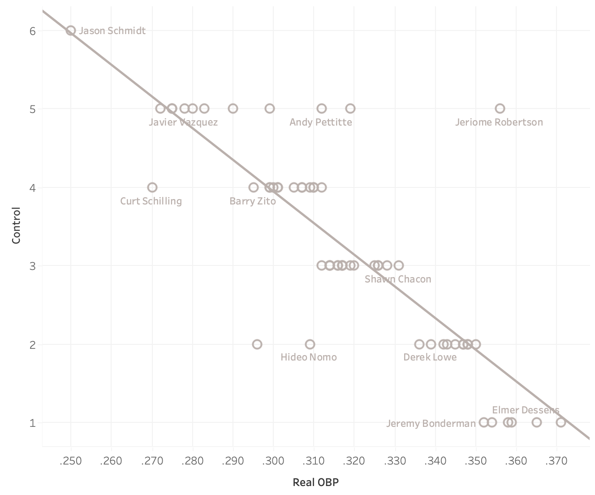

The Bot follows a similar formula but allows more flexibility and probability of these outlier command/out combinations (ex: 1C, 20 Out) as long as the expected OPS accuracy meets a certain threshold. Usually these *outlier charts* will have their baseline accuracy reduced by 1-5% to reduce the volume of outliers. It will also adjust the scale across Eras where league avg OBP values change compared to the Steroid Era. The estimated command is then used as an accuracy category.

To determine final accuracy an accuracy percentage is calculated per category and then weighted to create a score out of 100%. 

Here is an example for 2004 Base Set Steve Trachsel (based on 2003 statline):

Category     | Actual | Showdown | Accuracy | Weight
----------   | ------ | -------- | -------- | ------
Est. Control | 3.1    | 3.0      | 98.4%    | 30%
OBP Against  | .320   | .328     | 97.7%    | 30%
SLG Against  | .445   | .433     | 97.4%    | 20%
OPS Against  | .765   | .761     | 99.5%    | 20%
**Overall**  | -      | -        | 98.2%    | -

**The chart with the highest aggregate accuracy is chosen as the final chart returned by the bot.**

To display one of the other chart outputs, add the optional **chart_version**/ argument on the CLI or the **Chart** option on the website. It allows the user to use any of the other charts from the Top 5 most accurate list. Use the `--chart_version` argument if in the CLI or choose an **Chart** > 1 in the _Stats Version_ section of the website.

### **Defense**

#### _Hitters_
Each player can have a maximum of **2 position slots** for WOTC sets (2000-2005). That is expanded to **3 positions** for CLASSIC/EXPANDED sets.

For a position to qualify, the player has to make at least **7 appearances** or at least **15%** of games at that position. For multi-year/career long cards, **25%** of games must be played at that position. The positions are then limited to the top 2 slots (3 if CLASSIC or EXPANDED set) by number of appearances. 

In order for utility players to qualify for IF, they must have played each positions at least once in a single season or 15% of games for multi-season. To achieve IF+1 they must have a combined infield defense rating of +6. The rare IF+2 is achieved by having +10 or more. For example 2015 Marwin Gonzalez is eligible for IF and qualifies for IF+1 due having a combined +7 (1B+0, 2B+2, 3B+2, SS+3).

In WOTC sets (2000-2005), 2B/3B/SS can be combined to conform to 2 position slots. When combined, the average of the 2 positions will be used as the final value. Positions will be combined only if their in-game defensive ratings have a difference of 2 or less. For example if the player has SS+4 and 3B+1, they will stay separated.

In-game defensive ratings are calculated based on either Outs Above Avg (OAA), Total Zone Rating (tzr), Defensive Runs Saved (drs), or Defensive Wins Above Replacement (dWAR). The bot will choose which metric to use depending on the year:

- 1870-1953: dWAR
- 1953-2002: TZR
- 2003-2015: DRS
- 2016-PRES: OAA (EXCEPT CATCHERS)

All these metrics work by comparing a certain player to the average replacement at that position (0). For example a +10 TZR is an above average rating, while a -7 TZR is below average. 

All metrics are normalized to a per 150 game rating. Small sample sizes are adjusted when a player's rating falls outside the normal range after adjusting to 150 games.

The player's in-game rating is calculated with a percentile within a range. The player's in-game rating is calculated based on that percentile multiplied by the highest rating for each position (Ex: **SS: +5**, **LF/RF: +2**).

Ex: Francisco Lindor 2016 (+10 DRS in 155 games) in 2001 set
```
* SS Rating = Percentile * SS In-Game Max
* SS Rating = 0.911 * 5
* SS Rating = 4.55
* SS Rating = +5
```

For multi-year cards, the bot will take an average or median depending on which metric is used. Below is the breakdown for each metric.

- dWAR - MEDIAN
- TZR - MEDIAN
- DRS - MEDIAN
- OAA - AVG PER 162 GAMES AT POSITION

If the multi-year card spans across available metrics (ex: a card using 2014-2022), it will use the metric available for the entire period.

#### _Pitchers_
Pitchers fall under the following categories
1. STARTER: >40% of pitcher's appearances were starts
2. RELIEVER: >=60 % of pitcher's appearances were in relief
3. CLOSER: pitcher had at least 10 saves

### **Speed**

In-game SPEED is calculated differently depending on the year. 
* If the year is BEFORE or ON 2015, STOLEN BASES (per 650 PA) is used.
* If the year is AFTER 2015, SPRINT SPEED _(Sourced from Baseball Savant)_ is used along with STOLEN BASES (per 650 PA). A weighted avg is used where SPRINT SPEED has a 60% weighting and STOLEN BASES has a 40% weighting.
  * If the player's speed from using SB would be above 20 and is higher than their speed would be using SPRINT SPEED, the weighting is changed to 80% for SB and 20% for SPRINT SPEED.

The combination of SPRINT SPEED/STOLEN BASES is then converted to a percentile based off a range (the same way that defense is calculated). That percentile is then multiplied by the maximum in-game speed.

For example, the range of SPRINT SPEED is from 23 ft/sec to 31 ft/sec. If a player's SPRINT SPEED was 27ft/sec, they are in the 50th percentile (0.5). If the maximum in-game speed was 25, then this player's in-game SPEED is equal to 25 * 0.5, which rounds to **13**.

Eras can also effect speed. In Eras with a high average speed (ex: Dead Ball Era) speed will be slightly reduced compared to modern eras. The purpose of this is to maintain a balance of speed across time periods where SB numbers fluctuated.

When the card is using SB, a set based multiplier is used to match the original WOTC values. Ex: For a player with 26 SB per 650 PA, 31.72 would instead be used in the 2001 se (1.22x). For 2000/2001 sets, if variable speed is enabled the multiplier is changed to 1.05.

```
2000: 1.21
2001: 1.22
2002: 1.12
2003: 0.962
2004: 1.0
2005: 1.0
CLASSIC: 1.0
EXPANDED: 1.0
```

If the card uses SB and the player's speed is over 20, an separate linear scale is applied for values over 20. This results in a more evenly distributed set of players with 21-28 speed than the traditional 8-20 scale allows for. 

The formula for 21+ speed works as follows: **starting_point_over_20 + (elite_spd_percentile * remaining_slots_over_20)**. This starting point will change across sets (ex: 2002 starts scaling back at 22, 2005 starts at 21, 2001 Variable Spd at 20). The percentile uses **22 SB/400 PA** as the minimum (that's around the required SB to get to 20 SPD) and uses **100 SB** as the maximum. That means if you stole 100+ bases per 650 PA, you will get the maximum speed (28). 28 is the maximum speed, so if a player has over 100 SB/650 PA (ex: Rickey Henderson 1982) they will stay at 28 SPEED.

Here is an example using **Scott Podsednik's** 2004 stats in the 2005 set (63.8 SB/650 PA):
```
SPEED = 21 + (elite_spd_percentile * remaining_slots_over_20)
SPEED = 21 + ( (SB - 22) / (100 - 22) * (28 - 21) )
SPEED = 21 + ( (63.8 - 22) / (100 - 22) * (28 - 21) )
SPEED = 21 + ( 0.535 * 7 )
SPEED = floor(21 + 3.75)
SPEED = 24
```

_** Pitchers are automatically given a SPEED of 10._

### **Innings Pitched**

Innings pitched is calculated based a Pitcher's innings pitched / games played (IP/G). The components of that equation will change depending on the pitcher's type (STARTER vs RELIEVER). 

- STARTER: IP/GS
- RELIEVER: (IP - (GS * IP/GS)) / (G-GS)

Ex: Ranger Suarez (2021) (RELIEVER)
```
Stats:
    G: 39
    GS: 12
    IP/GS: 5.5
    IP: 123.2

IP = (IP - (GS * IP/GS)) / (G-GS)
   = (123.67 - (12 * 5.5)) / (39-12)
   = 57.67 / 27
   = 2.09
   = 2 IP
```
### **Icons**

Icons were a feature introduced in 2003 MLB Showdown sets. 

This is the list of available icons and how a player is eligible:

_** Some of these thresholds are slightly different than the original game._

* **S**: Won Silver Slugger Award.
* **G**: Won Gold Glove Award.
* **V**: Won AL or NL Most Valuable Player Award.
* **CY**: Won AL or NL CY Young Award.
* **R**: Selected season was during the player's rookie eligibility.
* **RY**: Won AL or NL Rookie of the Year Award.
* **20**: Won 20 or more games as a Pitcher.
* **K**: Was Top 2 in their league in SO.
* **HR**: Was Top 2 in their league in HR.
* **SB**: Was Top 2 in their league in SB.
* **RP**: Was Top 2 in their league in SAVES.

### **Points**

A player's point value is calculated by summing up a player's value provided in the following categories:

_Hitters_
* Onbase Pct
* Batting Avg
* Slugging Pct
* Defense
* Speed
* Home Runs
* Icons (03+)
* Command (Some sets)

_Pitchers_
* Onbase Pct Against
* Batting Avg Against
* Slugging Pct Against
* Innings Pitched
* Icons (03+)
* Position Bonus (Some Sets)
* Command (Some sets)

A player's point value in each category is calculated by multiplying the WEIGHT given to the category by the PERCENTILE the player placed in. 

The WEIGHT is the number of points provided if the player achieves the 100th percentile in that category. The percentile is calculated by taking difference between the player's stat and minimum values for a category, and dividing it by the difference between maximum and minimum values assigned to the category. The WEIGHT represents how many points a player will receive if they are in the 100th percentile in the category. _NOTE: WEIGHTS change across sets._

This calculation is performed for each category. The categorical point values are summed into the player's final total point value. 

Ex: **Derek Jeter, 550 PTS** _(2003 Set, 2002 Stats)_
```
Projected Showdown Statline:
    BA: .293
    OBP: .366
    SLG: .445
    OPS: .811

    PA: 730
    1B: 140
    2B: 25
    3B: 2
    HR: 23 (20.4 per 650 PAs)
    BB: 76
    SO: 107

    SPD: SPEED A (18)
    DEF: SS+0
    ICONS: None

Points (OBP) = WEIGHT * PERCENTILE
             = 150 * 0.56
             = 84.1 pts.
Points (BA) = WEIGHT * PERCENTILE
             = 70 * 0.64
             = 44.89 pts.
Points (SLG) = WEIGHT * PERCENTILE
             = 170 * 0.45
             = 75.96 pts.
Points (HR)  = WEIGHT * PERCENTILE
             = 50 * 0.42
             = 20.76 pts.
Points (SPD) = WEIGHT * PERCENTILE
             = 65 * 0.80
             = 52 pts.
Points (DEF) = WEIGHT * PERCENTILE
             = 65 * 0.0
             = 0 pts.

Points (Total) = Round(52 + 20.76 + 75.96 + 44.89 + 84.1)
               = 280

```
##### _Note: Pitchers have some categories (ex: BAA) where is percentile is reversed (1-percentile)_

There are additional weights/logic applied across the different sets to try to match to the original WOTC sets. 

- **Allow Negatives**: If True, allows a player to be penalized in the negative for a bad category. For example if a player is under the threshold defined for OBP, they will receive negative PTS for OBP. If False, player gets +0 PTS for that category if below threshold.
- **PTS Decay**: If enabled for the set, points above a certain mark cost a percentage less. This will help normalize star players points towards the mean. Ex: All Points above 500+ are multiplied by 0.75.
- **Positional Defense Weights**: In some sets, certain positions are weighted lower than others. For example in the 2003 set, LF/RF max defense (+2) is worth 25% less than max CF defense (+3)
- **Command Outs Adjustment**: In some sets, certain Command - Out combinations receive a manual adjustment to closer match WOTC. These are often small adjustments (1-5%) that only are applied to slashline and HR point categories. These help balance out points for cards that work better for stategy and advanced play.

### **Multi-Year Cards**

Multi-year or career long cards can be created on Showdown Bot using the year input. Here are some examples:

- 2005-2010
- 2005+2007+2010+2013
- CAREER

Card methodology will slightly change if the user enters a multi-year card. Differences include:

- **SPEED**: Speed rating is based on the avg across the selected years. If the card crosses between using SB and Sprint Speed as metrics, it will use Sprint Speed if 35% of the seasons choosen are after 2015. Otherwise it will use SB as the benchmark.
- **TEAM**: If the choosen player played for multiple teams, the Bot will assign the team with the most games played.
- **DEFENSE**: For each qualified position, the Bot uses the **median** defensive metric (drs/tzr/dWar) calculated across the choosen years. If outs above avg is available, it takes uses 162 game average instead of a median. The qualification for positions increases from 15% -> 25%.
- **GB/FB**: The GO/AO ratio is averaged across choosen years.
- **Icons**: If the player qualified for an icon in any of the choosen seasons, he is granted the icon in the multi-year variant. This is excluding the R icon, which is only available in single-year cards.

### **Eras**

The original MLB Showdown game was built during the steroid era. This means the card formula is based on the Steroid Era run environment, where hitting was more dominant than pitching. In the year 2023 pitching is now stronger, and hitters are more focused on hitting home runs at the cost of more strikeouts. These evolutions are common throughout baseball history, and the Bot's eras feature helps adapt cards to be normalized across these different periods.

Each Era adjusts the baseline opponent to better represent the run scoring environment of that period. This means cards will produce more accurate due to them facing the average opponent of their era rather than the average opponent of the _Steroid_ era. In the newest Showdown Bot release, this will now adjust dynamically year to year. If the user manually selects an era, the adjustment will use an average of league stats across years.

For example, below are 2001 set baseline pitcher attributes during the _Steroid_ and _Statcast_ eras.

Attribute | Steroid Era (2000) | Statcast Era
---       | ---                | --- 
Control   | 16.0               | 16.7
Outs      | 3.0                | 3.13
SO        | 3.75               | 4.46

Because the average control and outs are higher in the _Statcast_ Era, hitter charts will be improved in order to reach their expected season stats. Hitter chart strikeouts will decrease as well due to the pitchers having more results on their charts.

There are also slight other adjustments across eras, including reducing speed slightly for eras where stolen bases were extremely high.

### **Negro Leagues and Pre-20th Century**

As of the 3.0 update, Showdown Bot now supports all players from Baseball Reference, including the Negro Leagues and pitchers from the 19th century. Data for these players is not fully available, so the Bot does it's best to fill in gaps through estimation. Any estimation will show a **'*'** next to the category in the breakdown section.

Here are the stats that the Bot will estimate if unavailable:

Pitchers
- PA: Uses BF if available, otherwise predicts PA based on IP * 4.25 (represents a league avg)
- 2B: Predicts 2B based on player's ERA percentile (1.0-5.0). Max value is 25% of total hits allowed.
- 3B: Predicts 2B based on player's ERA percentile (1.0-5.0). Max value is 2.5% of total hits allowed.
- SLG: Derived from 2B and 3B estimations from above.
- OBP: Derived using PA estimation from above as denominator.
- RATIO: Estimates GO/AO ratio based on estimated SLG (higher the SLG, more FB on chart)

Hitters
- SB: Will use SPEED 12 if SB not available.

### **shOPS+**

shOPS+ takes a player's projected in-game OPS and normalizes it across the entire set in that year (26 players/team). It adjusts a player's OPS slightly to account for a typical Showdown manager's tendency to draft higher Onbase/Control cards. A score of 100 is league average, and 175 is 75% better than the league average.

For example, Yandy Diaz's 2022 **CLASSIC** card (10 Onbase) had a projected .838 OPS, which was 48% better than the 2022 MLB average after being adjusted to account for higher control pitching. As a result, his shOPS+ was 148.

The `Command Adjustment Factor` is a way for shOPS+ to account for normal Showdown draft tendencies. Managers tend to weight gaining the advantage over number of outs on their player's chart. One player's stats against the "avg" player in a set may not match the typical card drafted in a real Showdown draft setting.

**Calculation:**

##### _Note: Numerator and deominator are flipped for pitchers._
```
((PLAYER_PROJ_OBP / LEAGUE_AVG_PROJ_OBP) + (PLAYER_PROJ_SLG * COMMAND_ADJUSTMENT_FACTOR / LEAGUE_AVG_PROJ_SLG) - 1) x 100
```

## **Editions**

Use Editions to add style variety to your cards. There are currently 6 different Editions available on Showdown Bot.

1. [Cooperstown Collection](#cooperstown-collection)
2. [Super Season](#super-season)
3. [Nationality](#nationality)
4. [All-Star Game](#all-star-game)
5. [Rookie Season](#rookie-season)
6. [Holiday](#holiday)

### **Cooperstown Collection**

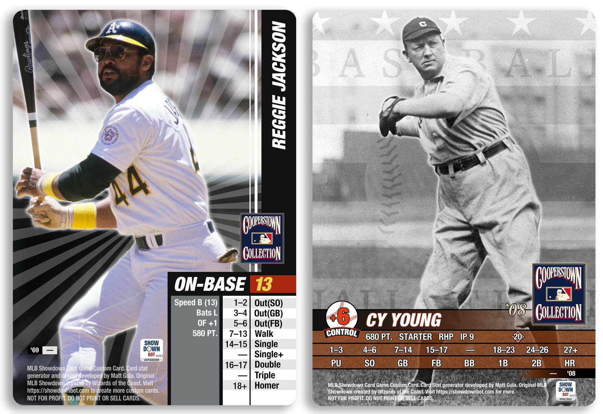

Cooperstown theme is available on all sets. It replaces the player's team logo with a the official Cooperstown Collection logo, changes the template color in 04/05 sets, and some certain players adds new player art.

Custom player art is available in 2003, 2004, and 2005 sets. CLASSIC/EXPANDED sets will use the official Cooperstown color scheme in the chart.

### **Super Season**

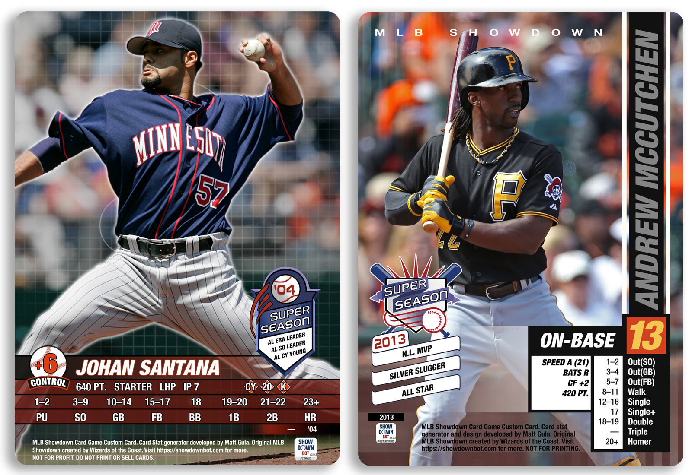

Super Seasons highlight outstanding single season performances throughout baseball history. A custom super season logo may replace the player's team logo, and certain years add a list of up to 3 accolades. 2004 and 2005 sets feature a special red template, as well as a grid pattern in the background of all showdown library sourced player images.

Below are the possible accolades, ordered by priority. Multi-year cards follow a similar pattern, however will aggregate cross-year accolades together (ex: 7X ALL STAR).

** _Note if the accolade's text is too long and does not fit within the image, it will excluded._

**1. AWARD WINNER**: If the player won any of the following awards, they will show up first in the accolades. The exception is sets that include icons (03,04,05), where awards are deprioritized to the end.

- CY YOUNG
- MVP
- ROOKIE OF THE YEAR
- GOLD GLOVE
- SILVER SLUGGER
- ALL STAR

**2. AWARD PLACEMENT**: If the player was in the Top 3 for MVP or Cy Young voting, it is prioritized second.
 
**3. LEAGUE RANKING**: Prioritized third is league rankings within the metrics below. These are ranked first based on placement, then based on the ordering below.

HITTERS

1. HR
2. BA
3. OBP
4. SLG
5. OPS
6. DOUBLES
7. TRIPLES
8. RBI
9. SB
10. WALKS
11. HITS
12. RUNS
13. TOTAL BASES
14. WAR
15. OPS PLUS

PITCHERS

1. ERA
2. SAVES
3. SO
4. WHIP
5. WINS
6. IP
7. ERA PLUS
8. WAR
9. SHUTOUTS
10. CG
11. W/L%
12. SO/9
13. FIP

**4. STATS**: If the player does not have enough awards and accolades, their stats will be used. See below for ordering and minimum requirements.

Some stats include a historical cutoff, meaning if the player's stat is greater or equal to that number it will be included.

**HITTERS**

Stat | Season Min. | Season Historical | Career Historical
---  | -------     | -------------     | ----------------- 
HR   | 30          |      60           |   500 
RBI  | 100         |      -            |    -
HITS | 175         |     240           |   3000
BA   | .300        |     .390          |    -
OBP  | .400        |      -            |    - 
SLG  | .550        |      -            |    - 
dWAR | 2.5         |      -            |    -
OPS+ | -           |      -            |    -
bWAR | -           |      -            |    -


**PITCHERS**


Stat   | Season Min. | Season Historical | Career Historical
---    | -------     | -------------     | ----------------- 
WINS   | 14          |     -             |    - 
SAVES  | 20          |     -             |    -
ERA    | -           |     -             |    -
WHIP   | -           |     -             |    -
bWAR   | -           |     -             |    - 


Here is an example of how the Bot ranks accolades for 1999 Chipper Jones:

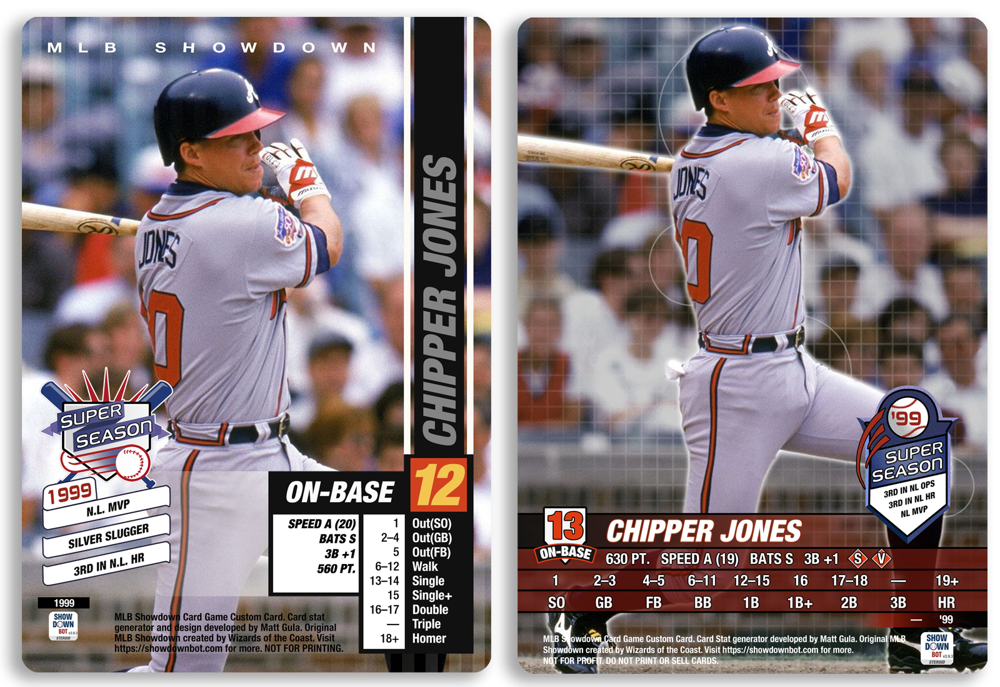

Rank | 2000-2002 Sets        | 2003-2005 Sets
---  | ----------------------| --------------
1    | NL MVP                | 3RD IN NL HR
2    | SILVER SLUGGER        | 3RD IN NL OPS
3    | 3RD IN NL HR          | 3RD IN NL WALKS
4    | 3RD IN NL OPS         | NL MVP
5    | 3RD IN NL WALKS       | 4TH IN NL OBP
6    | 4TH IN NL OBP         | 4TH IN NL SLG
7    | 4TH IN NL SLG         | 4TH IN NL TOTAL BASES
8    | 4TH IN NL TOTAL BASES | 5TH IN NL WAR
9    | 5TH IN NL WAR         | 2ND IN NL OPS+
10   | 2ND IN NL OPS+        |  7TH IN NL 2B 
11   | 7TH IN NL 2B          |  7TH IN NL RUNS 
12   | 7TH IN NL RUNS        |  SILVER SLUGGER 
13   | 10TH IN NL BA         |  10TH IN NL BA 
14   | 110 RBI               |  110 RBI 
15   | 181 HITS              |  181 HITS 

Note that in the final version for the 2004 set, _NL MVP_ is shown despite it being ranked 5th. This is because the prior accolades would have been cut-off in the image!

### **Nationality**

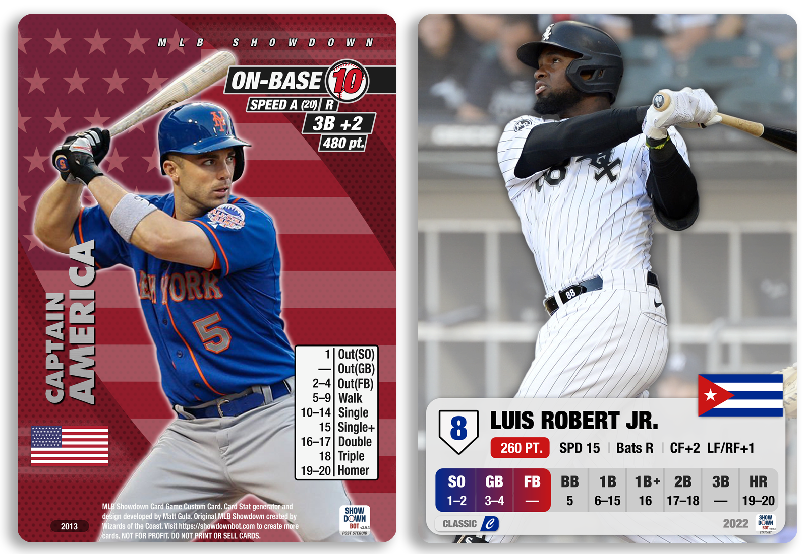

Replaces a player's MLB team with their birthplace country. Adds a custom background for all sets that is inspired by WOTC promo cards. For automated images, there will be some World Baseball Classic player images available.

List of supported countries:
 - United States
 - Domican Republic
 - Venezuela
 - Cuba
 - Canada
 - Mexico
 - Puerto Rico
 - Panama
 - Japan
 - Great Britain
 - Australia
 - Colombia
 - South Korea
 - Netherlands
 - Italy
 - China
 - Israel
 - Czech Republic
 - Nicaragua
 - Germany
 - Taiwan
 - Curacao

2004 and 2005 sets feature a special red template, as well as a grid pattern in the background of select players. CLASSIC/EXPANDED sets feature a new gradient design for the outs portion of player charts.

### **All-Star Game**

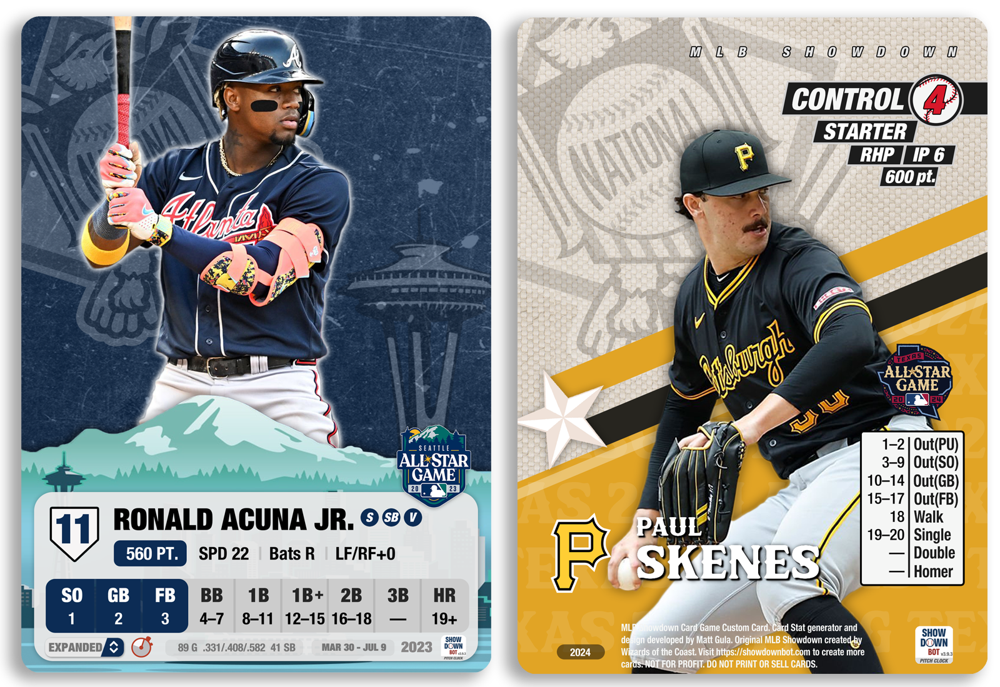

All Star Game logos are available on all sets for all seasons since 1980. Since 2021, custom background art and is available and will continued to be updated every year.

### **Rookie Season**

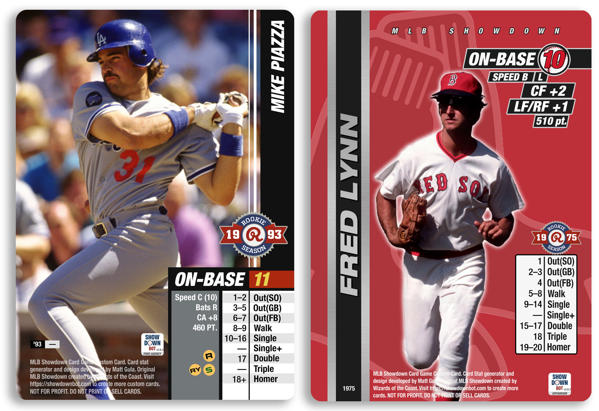

Rookie Season replaces a player's team logo with a custom rookie season icon.

### **Holiday**

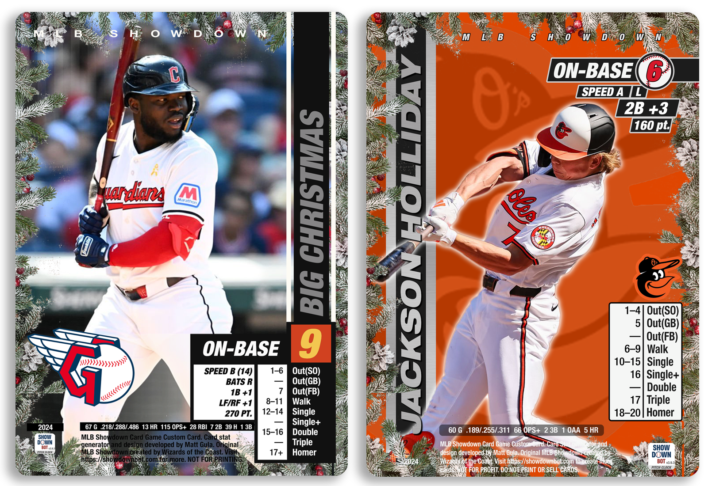

The Holiday theme adds a simple Christmas Tree inspired border to any card. This includes user uploaded photos, automated images, and silhouettes. 

### **Postseason**

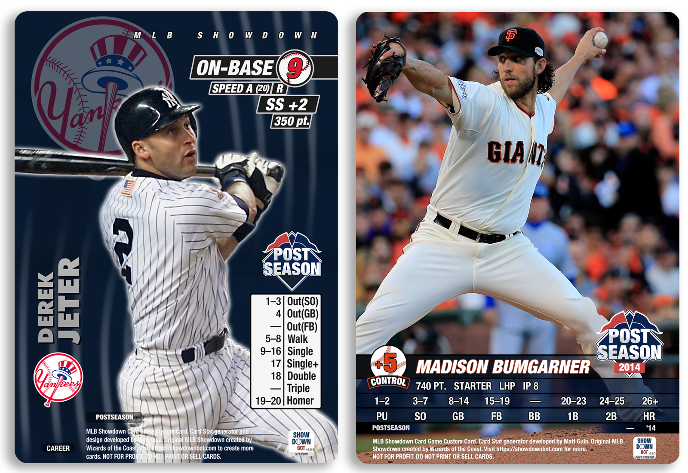

Adds postseason logo to images. Only available when the Postseason period is selected.

## **New Sets**

 **Showdown Bot now includes new sets that modernize the look and play of MLB Showdown!**


### **Design**

The CLASSIC/EXPANDED set designs takes elements from classic MLB Showdown sets and add a modern twist, resulting in a streamlined design that will look great with any background image. Chart and Command colors will change from team to team, creating a blend of 2000/2001's color with 2004/2005's simplicity.


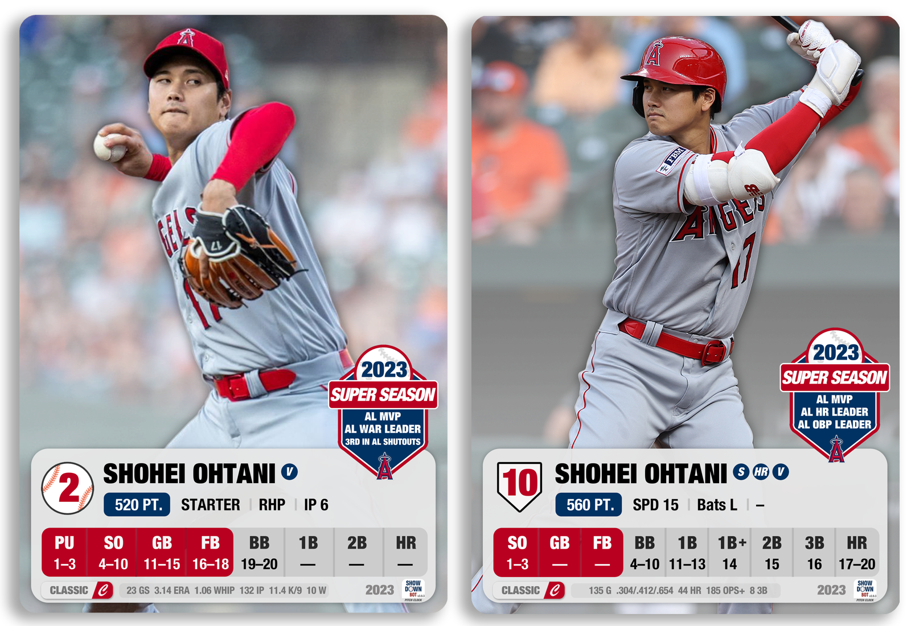

### **Styles**

These sets are split between **Classic** and **Expanded** styles, with the goal of offering modern cards to every type of Showdown fan. The Classic style is most compatible with 2000/2001 sets, while Expanded fits with 2002-2005 sets. You will see a visual indicator of the card style in the bottom left of each card.

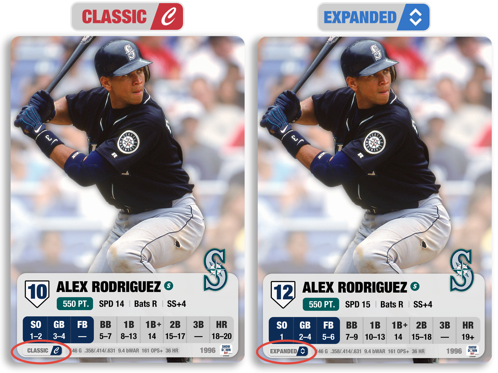

### **Classic**

The Classic Style is made for the OG Showdown fan who prefers the 2000/2001 sets. In this style, hitters have lower Onbase numbers (between 4-12) but better charts. It uses the 2001 set as a starting point, but alters the original formula to fix gaps while maintaining compatibility.

Changes from 2001 set:
- **SPEED**: Expands options from 10/15/20 to the full range of 8-25.
- **ICONS**: Icons will appear on the card. Players can optionally incorporate them into gameplay or simply have them as a visual representation of awards and rookie status.
- **MORE COMMAND-OUT COMBINATIONS**: In order to increase variety and accuracy of cards, more possible Onbase/Control + Out combinations have been added. For example it is possible to have a 4 Control pitcher with 19 outs, or a 9 Onbase hitter with 6 Outs. This will help increase balance of low onbase and high SLG hitters (ex: Javy Baez), who under normal Showdown constraints were constrained to lower Onbase numbers.
- **DEFENSIVE RANGES**: Certain positions will see an increase in AVG in-game defense. This includes SS, CF, and 3B. Ex: 2018 Francisco Lindor goes from +5 SS in 2001 set to +7 SS in CLASSIC/EXPANDED sets. It also allows for negative defense across all positions (ex: Matt Kemp 2010).
- **NUMBER OF POSITIONS**: Now a player has a maximum of 3 available positions. This provides more value to super utility players like Ben Zobrist and Kris Bryant.

### **Expanded**

The Expanded Style is made for the new school Showdown fan who prefers the 2002-2005 sets. In this style, hitters have higher Onbase numbers (between 7-16) but less impactful charts. Charts also expand past 20, creating possible results outside of the normal 1-20 range. It uses the 2005 set as a starting point, but alters the original formula to fix gaps while maintaining compatibility.

Changes from 2005 set:
- **PITCHER CHART HRS**: To account for an increase in HRs, the minimum requirement for HR on a pitcher's chart has decreased, resulting in more HR results.
- **MORE COMMAND-OUT COMBINATIONS**: In order to increase variety and accuracy of cards, more possible Onbase/Control + Out combinations have been added. For example it is possible to have a 4 Control pitcher with 19 outs, or a 10 Onbase hitter with 8 Outs. This will help increase balance of low onbase and high SLG hitters (ex: Javy Baez), who under normal Showdown constraints were constrained to lower Onbase numbers.
- **DEFENSIVE RANGES**: Certain positions will see an increase in AVG in-game defense. This includes SS, CF, and 3B. Ex: 2021 Francisco Lindor goes from +3 SS in 2005 set to +4 SS in CLASSIC/EXPANDED sets. It also allows for negative defense across all positions (ex: Matt Kemp 2010).
- **NUMBER OF POSITIONS**: Now a player has a maximum of 3 available positions. This provides more value to super utility players like Ben Zobrist and Kris Bryant.
- **LF/RF Eligibility**: Now any player that played CF also qualifies for LF/RF. This offers players more diverse lineup options.

### **Dark Mode**

There is now an additional option for **Dark Mode**, available on all sets. Works with any player!

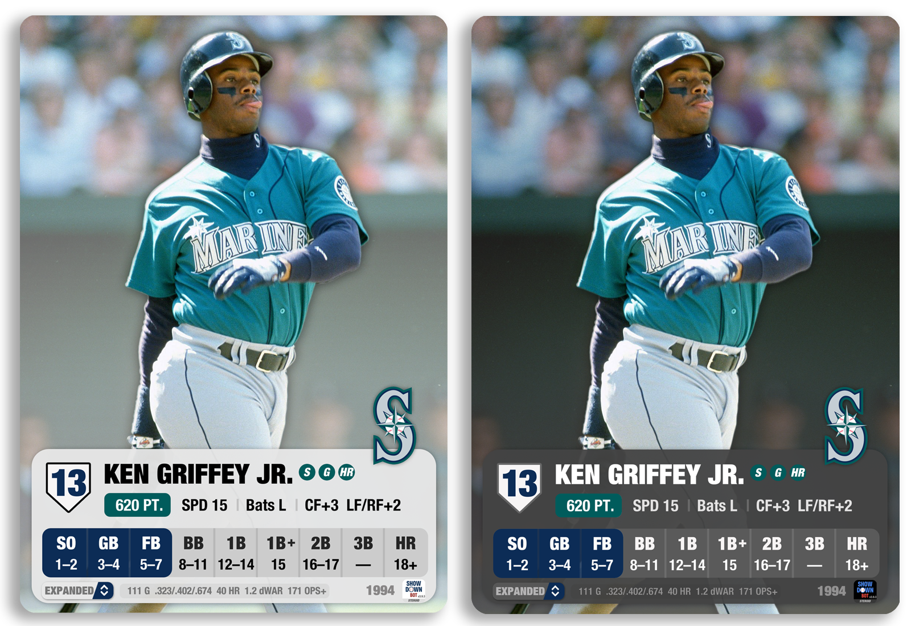

## Parallels


**Image Parallels** add unique and bold designs to make Showdown cards pop! They work on all automated images and across all sets.

Available Parallels:
- Rainbow Foil
- Team Color Blast
- Gold
- Gold Rush
- Gold Frame
- Sapphire
- Black and White
- Radial
- Comic Book Hero
- White Smoke
- Flames
- Mystery
- Moonlight

Stay tuned for more image parallels coming soon!

## Periods

The periods option lets you choose the exact period of stats to use for your Showdown card.

These are the available options:
- Regular Season
- Postseason
- Date Range
- Split

### Regular Season

This is the default period, and will include all games within the selected season(s). Excludes postseason.

### Postseason

Includes postseason stats from all rounds. Future update will let the user filter to certain rounds (ex: World Series).

Certain stat inputs are unavailable for the playoffs. The following stat inputs will use regular season values:
- Sprint Speed
- Defense

### Date Range

Filters data to only games within a date range.

**NOT available for multi-year cards.**

Certain stat inputs are unavailable for exact date ranges. The following stat inputs will use full regular season values:
- Sprint Speed
- Defense

### Split

Filter to stats from a particular split on baseball reference. See player's "Splits" pages for available values. Name must match exactly.

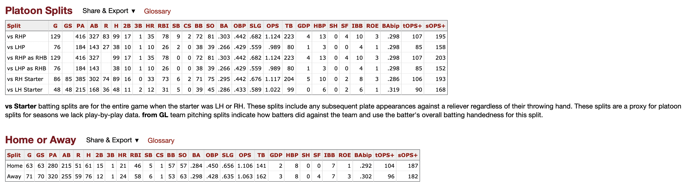

Certain stat inputs are unavailable for splits. The following stat inputs will use full regular season values:
- Sprint Speed
- Defense

## More Options

The More Options menu provides additional customizations to your Showdown Cards

### Border

Adds border to image. If auto image, player image will bleed into the border. Otherwise fills in the border with the player's team color.

### Dark Mode

Dark Mode will change the following sets chart colors to black:

- 2004
- 2005
- CLASSIC
- EXPANDED

It will also change the background color for compatible image parallels (ex: *Team Color Blast*)

### Year Text

Adds a text box with the player's year for the following sets:

- 2000
- 2001
- 2002
- 2003

Adds a year abbreviation (ex: *'96*) to the following sets:

- 2004
- 2005
- CLASSIC
- EXPANDED

### Set Year +1

For 2004/2005 sets, changes the year abbrevation on the bottom right to be the year + 1. For example if the card's original year is *2022*, the text shown will be *'23*.

### Remove Team Branding

Removes all team logos.

### Use Secondary Team Color

Will change the team color to their secondary color for all card art assets and charts.

### Nicknames

Replace the player's name with their nicknames sourced from [here](https://www.baseball-reference.com/friv/baseball-player-nicknames.shtml). Users can choose any of the first 3 nicknames, order will match the order provided by baseball reference in the link above.

### Variable Speed

Expands speed options for 2000 and 2001 sets to use the full range of numbers between 8 and 28.

### Glow x2, x3
Like more glow? Will add 2x or 3x the glow/shadow to automated images.

## Uploading Custom Images

Tips for uploading your own custom images:

 - Ideal image size is `1500x2100` for normal cards. For bordered cards, use `1644x2244`.
 - For best results, use images with `300 PPI`
 - Showdown bot will center and crop your image for you, so make sure the player is centered in the original.
 - If image uploads fail, wait a few seconds and try again. Sometimes larger image will take 5-10 seconds to upload.
 - For 2000/2001, cut out the player image for best results. Add an outer glow to match the original sets. The team background will be added automatically.

----
## Showdown Explorer

The Showdown Explorer tool leverages the power of the Showdown Library to provide the user with the ability to discover and explore cards from 1900-Present.

_In depth walkthroughs and guides will be linked here in a future update._

----
## Running Locally

You can [clone](https://docs.github.com/en/repositories/creating-and-managing-repositories/cloning-a-repository) this repository and run it locally on your machine. Be sure you have went through the [prerequisites](#prerequisites) before proceeding.

Here are the high level steps:

1. [Clone](https://docs.github.com/en/repositories/creating-and-managing-repositories/cloning-a-repository) this repository to your local machine
2. Open Terminal (MacOS) or Windows CLI
3. Change the current working directory to the location where you cloned in step 1.
4. Create a new [virtual environment](https://virtualenv.pypa.io/en/latest/) (optional)
5. Install required package dependencies ([instructions](https://stackoverflow.com/questions/7225900/how-can-i-install-packages-using-pip-according-to-the-requirements-txt-file-from))

After installing and handling any package errors, you can run Showdown Bot from the command line or locally in a browser.

Command Line
```
python mlb_showdown_bot --name "Mike Piazza" --year 1997 --set 2001
```

Flask App (opened via Browser)
```
python app.py
```

----
## Contact the Dev

You can reach out to the developer of MLB Showdown Bot through email mlbshowdownbot@gmail.com

Follow MLB Showdown Bot Twitter for updates and card posts!

[](https://twitter.com/mlbshowdownbot)