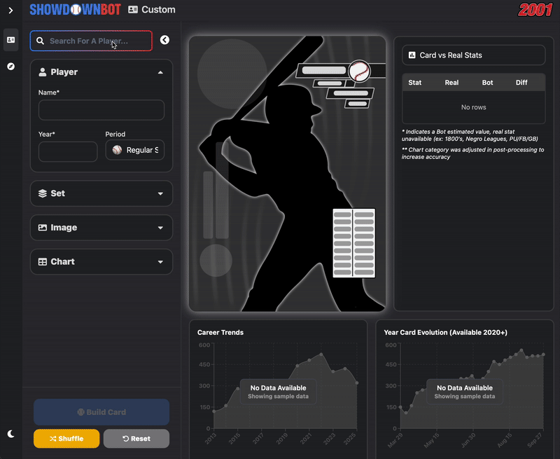

<div align="center">
  
  
  **The ultimate tool for creating custom MLB Showdown cards**
  
  [](https://showdownbot.com)
  [](https://twitter.com/mlbshowdownbot)
  [](https://python.org)
  [](LICENSE)
  
  
</div>

---

## ✨ Quick Start

Create custom MLB Showdown cards in seconds! Just provide a **player name**, **season**, and optionally an **image** - Showdown Bot handles all the complex calculations.

```bash
# Install from PyPI
pip install mlb-showdown-bot

# Create a card instantly
showdown_bot card -n "Mike Piazza" -y 1997 -s 2001
```

```python
# Or use in Python
from mlb_showdown_bot.core.card.card_generation import generate_card

card = generate_card(
    name='Mike Piazza',
    year='1997',
    set='2001'
)
```

---

## 📚 Table of Contents

### 🚀 Getting Started
- [Quick Start](#-quick-start)
- [Installation](#-installation)
- [Prerequisites](#prerequisites)

### 🔧 How It Works
- [Player Identification](#1-player-identification)
- [Data Collection](#2-data-collection)
- [Player Overrides](#3-player-overrides)

### 📊 Card Creation Formula
- [Chart Generation](#creating-a-chart)
- [Defensive Ratings](#defense)
- [Speed Calculation](#speed)
- [Point Values](#points)
- [Multi-Year Cards](#multi-year-cards)
- [Era Adjustments](#eras)
- [Historical Players](#negro-leagues-and-pre-20th-century)

### 🎨 Customization Options
- [Special Editions](#editions)
- [Visual Parallels](#parallels)
- [Time Periods](#periods)
- [Advanced Options](#more-options)
- [Custom Images](#uploading-custom-images)

### 🛠️ Development
- [Running Locally](#-development--local-setup)
- [API Documentation](#api)
- [Contributing](#contributing)

### 📞 Support
- [Contact](#-contact--support)

---

## 🛠️ Installation

### Prerequisites
- **Python 3.8+** - [Download here](https://www.python.org/downloads/)
- **(Optional)** Virtual environment manager like [pyenv](https://github.com/pyenv/pyenv) or [virtualenv](https://virtualenv.pypa.io/en/latest/)
- **(For local development)** [Node.js 18+](https://nodejs.org/) and npm 9+

### Install via PyPI (Recommended)

```bash
pip install mlb-showdown-bot
```

### Quick Usage Examples

**Command Line Interface:**
```bash
# Basic card creation
showdown_bot card -n "Mike Piazza" -y 1997 -s 2001

# With custom options
showdown_bot card -n "Barry Bonds" -y 2001 -s 2001 --edition super_season
```

**Python API:**
```python
from mlb_showdown_bot.core.card.card_generation import generate_card

# Generate and display card
card = generate_card(
    name='Mike Piazza',
    year='1997',
    set='2001',
    print_to_cli=True,   # Show ASCII representation
    show_image=True      # Open image when complete
)
```

---


## 🔧 How It Works

Showdown Bot transforms real baseball statistics into balanced MLB Showdown cards through a sophisticated 4-step process:

### 1. Player Identification

The system uses multiple methods to find your player:

1. **Internal Database**: First checks our comprehensive player mapping (Name → Baseball Reference ID)
2. **Smart Search**: If not found, searches "baseball reference {name} {year}" using Bing
3. **Fuzzy Matching**: Handles variations in player names and nicknames

<div align="center">
  
</div>

> 💡 **Pro Tip**: Having trouble finding a player? Try using their Baseball Reference ID (e.g., `degroja01`) as the name input.

### 2. Data Collection

**Primary Sources:**
- 📊 **[Baseball Reference](https://www.baseball-reference.com)**: Complete statistics for ~20,000 MLB players
- ⚡ **[Baseball Savant](https://baseballsavant.mlb.com)**: Modern metrics (2015+) including sprint speed and defensive stats

**What Gets Collected:**
- **Hitters**: BA, OBP, SLG, HR, SB, defensive metrics, etc.
- **Pitchers**: Opponent batting stats (BA against, OBP against, etc.)
- **Modern Era**: Sprint speed, outs above average, advanced defensive metrics

**⚠️ Limitations:**
- Minor League statistics (insufficient opponent data)
- Spring Training games (statistical reliability)
- Foreign leagues (data availability)

### 3. Player Overrides

Customize cards using parenthetical modifiers after the player name:

| Override | Purpose | Example |
|----------|---------|---------|
| `(PITCHER)` | Force pitching stats for two-way players | `Shohei Ohtani (PITCHER)` |
| `(HITTER)` | Force hitting stats for pitchers who hit | `Michael Lorenzen (HITTER)` |
| `({TEAM})` | Use stats from specific team only | `Manny Ramirez (LAD)` |

**Team Override Benefits:**
- Perfect for mid-season trades
- Focus on peak team performance

> 📅 **Note**: Team overrides work for seasons 1918+ and single-year cards only.

### 4. Card Generation

The final step converts real statistics into balanced Showdown mechanics:

**Statistical Analysis:**
- Compare player performance to era-appropriate baselines
- Calculate optimal Command/Control and Outs combinations
- Generate probability-based charts that match real performance

**Visual Creation:**
- Dynamic image generation using [Pillow](https://pillow.readthedocs.io/en/stable/)
- Support for custom images and automated player photos
- Special editions and visual effects

---


## 📊 Card Creation Formula

*This section explains how real baseball statistics become balanced Showdown cards. While technical, it's designed to be understood by any baseball fan.*

### The Science Behind the Cards

**Core Philosophy**: Every Showdown card should produce statistics that closely match the player's real-life performance when played against average opponents.

### Creating a Chart

> 📝 **Note**: In the codebase, ONBASE (hitters) and CONTROL (pitchers) are referred to as **COMMAND**.

**The Process:**
1. **Generate Multiple Options**: Create charts for every possible Command value in the chosen set
2. **Test Variations**: Run each Command with different Out totals (±1 adjustment)  
3. **Statistical Validation**: Compare projected in-game stats against real performance
4. **Select Best Match**: Choose the chart with highest accuracy across key categories

**Accuracy Metrics:**
- **OBP** (On-Base Percentage)
- **SLG** (Slugging Percentage)  
- **OPS** (Combined On-base Plus Slugging)

### Baseline Opponents

Every calculation uses "baseline opponents" - representing the average pitcher or hitter a player would face in-game. These baselines vary by set and era to maintain historical accuracy. 


**Example: 2001 Set Baseline Hitter (Used for pitchers)**
```yaml
Set: 2001
Command: 7.10
Chart Results (out of 20):
  - SO: 0.85
  - GB: 1.12  
  - FB: 1.15
  - BB: 5.10
  - 1B: 7.83
  - 2B: 1.60
  - 3B: 0.25
  - HR: 2.10
```

### Era-Based Adjustments

**The Challenge**: Baseball has changed dramatically since the original 2000-2005 Showdown sets. For example today's game features more strikeouts and lower offensive numbers.

**The Solution**: Dynamic baseline adjustment based on MLB league averages.

**Real-World Example**: 
- **Aaron Judge 2024** in 2001 style gets boosted stats because 2024 pitching is significantly better than 2000 pitching
- **Ty Cobb 1911** gets adjusted for Dead Ball Era offensive environment
- This ensures cards remain balanced regardless of when the player actually played

> 🎯 **Goal**: Maintain the spirit and balance of original WOTC sets while accommodating baseball's evolution.

### Chart Population Algorithm

**Chart Categories:**
- **Pitchers**: PU, SO, GB, FB, BB, 1B, 2B, HR
- **Hitters**: SO, GB, FB, BB, 1B, 1B+, 2B, 3B, HR

**Core Formula:**
```
Chart Results = (Real Results per 400 PA - Baseline Opponent Impact) / Player Advantage Factor
```

**Key Principles:**

🎲 **400 PA Standard**: All statistics normalized to 400 plate appearances (matches 20×20 dice roll combinations)

📊 **Methodology Variations**: 
- **Rate-based**: 2000/2001/Classic (uses actual ratios)
- **Percentage-based**: 2003+ sets (uses league percentages)

⚡ **1B+ Calculation**: Stolen base results inversely weighted by OnBase rating
- Lower OnBase = More 1B+ opportunities (get advantage less often)
- Higher OnBase = Fewer 1B+ results (already get advantage frequently)

🎯 **Smart Rounding**: 
- Custom rounding thresholds per set (e.g., HR rounds up at 0.425 in early sets)
- Automatic accuracy adjustments to maintain OBP/SLG targets
- Redistributes results between categories when rounding causes inaccuracies

**Quality Control:**
```yaml
Adjustment Triggers:
  - Projected SLG < Real SLG
  - Projected OPS < Real OPS  
  - SLG difference > 1%
  - OBP difference < 3%
Result: Boost power categories, reduce singles
```
   

### Expanded Sets (21+ Results)

**The Challenge**: Later Showdown sets feature results beyond 20, activated by strategy cards.

**The Solution**: Weighted slot distribution system.

**How It Works:**
- Slots 1-20 get reduced weight (e.g., 0.975 instead of 1.0)
- Remaining probability distributed across slots 21-30
- Distribution pattern varies by set, player type, and command level

**Example Distribution:**
```yaml
Slots 1-20: 0.95 each
Extended Results:
  21: 0.250 (most likely)
  22: 0.200
  23: 0.160
  24: 0.128
  25: 0.102
  26: 0.081
  27: 0.065
  28: 0.012
  29: 0.002
  30: 0.000 (least likely)
```

**Distribution Methods:**
- **Linear**: Equal decrease per slot
- **Linear Decay**: Accelerating decrease  

### Chart Selection Process

**The Competition**: Every possible Command/Out combination competes for accuracy.

**Evaluation Criteria:**
- **OBP Accuracy** (highest weight)
- **SLG Accuracy** (medium weight)  
- **OPS Accuracy** (combined metric)
- **Command Estimation** (for post-2002 sets)

### Command-OBP Relationship

**Historical Pattern**: WOTC used linear scaling between Command and real OBP in later sets.

<div align="center">
  
  <p><em>2004 Pitcher Command follows predictable OBP pattern</em></p>
</div>

**Our Approach**: 
- Follow WOTC's linear relationship as baseline
- Allow "outlier" combinations (e.g., 1 Command, 20 Outs) if accuracy justifies it
- Apply 1-5% accuracy penalty to limit outliers
- Adjust scaling for different eras and league averages

### Final Accuracy Scoring

**Weighted Accuracy System**: Each category contributes to a final score out of 100%.

**Example: 2004 Steve Trachsel**
| Category | Real | Projected | Accuracy | Weight | Score |
|----------|------|-----------|----------|--------|-------|
| Est. Control | 3.1 | 3.0 | 98.4% | 30% | 29.5% |
| OBP Against | .320 | .328 | 97.7% | 30% | 29.3% |
| SLG Against | .445 | .433 | 97.4% | 20% | 19.5% |
| OPS Against | .765 | .761 | 99.5% | 20% | 19.9% |
| **Total** | - | - | **98.2%** | - | **98.2%** |

> 🏆 **Winner Selection**: The chart combination with the highest weighted accuracy becomes the final card.

**Alternative Charts**: 
- CLI: Use `--chart_version 2` through `5` for other top options
- Website: Select a "Chart Version" in the Charts section.

### Defense

**Position Limits:**
- **WOTC Sets (2000-2005)**: Maximum 2 positions
- **Classic/Expanded Sets**: Maximum 3 positions

### Hitter Defense

**Qualification Requirements:**
| Card Type | Minimum Games | Minimum Percentage |
|-----------|---------------|-------------------|
| Single Season | 7 appearances | 15% of team games |
| Multi-Year | - | 25% of team games |

**Special Positions:**

🛠️ **Infield (IF) Eligibility:**
- Must play each infield position at least once (single season) or 15% (multi-season)
- **IF+1**: Combined infield rating ≥ +6
- **IF+2**: Combined infield rating ≥ +10
- Example: 2015 Marwin Gonzalez → IF+1 (1B+0, 2B+2, 3B+2, SS+3 = +7 total)

**Position Combining (WOTC Sets Only):**
- 2B/3B/SS can merge if ratings differ by ≤2
- Uses average of combined positions
- Example: SS+4 and 3B+1 stay separate (difference = 3)

### Defensive Metrics by Era

| Years | Primary Metric | Reason |
|-------|----------------|---------|
| 1870-1953 | dWAR | Only comprehensive data available |
| 1953-2002 | Total Zone Rating (TZR) | Gold standard for this era |
| 2003-2015 | Defensive Runs Saved (DRS) | Improved methodology |
| 2016-Present | Outs Above Average (OAA) | Most accurate modern metric |

> ⚾ **Exception**: Catchers continue using DRS even in modern era

**Calculation Process:**
1. **Normalize** to 150-game standard
2. **Calculate percentile** within position range  
3. **Apply to maximum** position rating

**Example: Francisco Lindor 2016**
```yaml
Real Performance: +10 DRS in 155 games
Percentile vs SS: 91.1% (elite)
Position Max: +5 SS
Final Rating: 0.911 × 5 = +5 SS
```

**Multi-Year Aggregation:**
- **dWAR/TZR/DRS**: Use median (reduces outlier impact)
- **OAA**: Use average per 162 games (more stable for tracking data)

### Pitcher Categories

| Type | Qualification |
|------|---------------|
| **Starter** | >40% appearances as starts |
| **Reliever** | ≥60% appearances in relief |  
| **Closer** | ≥10 saves in season |

### Speed

**Methodology Evolution**: Speed calculation adapts to available data quality.

### Speed Metrics by Era

| Years | Primary Source | Secondary Source | Weight Split |
|-------|----------------|------------------|--------------|
| ≤2015 | Stolen Bases only | - | 100% SB |
| 2016+ | Sprint Speed | Stolen Bases | 60% / 40% |
| 2016+ (Elite Base Stealers*) | Stolen Bases | Sprint Speed | 80% / 20% |

> *Elite adjustment when SB-based speed >20 and exceeds Sprint Speed rating

### Calculation Process

**Step 1: Raw Metric → Percentile**
```yaml
Sprint Speed Range: 23.0 - 31.0 ft/sec
Example: 27.0 ft/sec = 50th percentile
```

**Step 2: Percentile → Game Speed**
```yaml  
Percentile × Maximum Speed = Final Rating
0.50 × 25 max = 13 Speed
```

### Era & Set Adjustments

**Historical Balance**: Speed slightly reduced in high-steal eras (Dead Ball Era) to maintain cross-era balance.

**Set-Specific Multipliers** (SB-based cards):
```yaml
2000: ×1.21    2003: ×0.962
2001: ×1.22    2004: ×1.00
2002: ×1.12    2005: ×1.00
Variable Speed (2000/2001): ×1.05
```

### Elite Speed (21+ Rating)

**The Challenge**: Traditional 8-20 scale compressed elite speedsters.

**The Solution**: Extended linear scaling for 21-28 range.

**Formula**: 
```
Elite Speed = Base(21) + (Elite% × Remaining Slots)
```

**Elite Scale**:
- **Minimum**: 22 SB/400 PA (≈ 20 Speed threshold)
- **Maximum**: 100 SB/650 PA (= 28 Speed maximum)

**Example: Scott Podsednik 2004 (63.8 SB/650 PA)**
```yaml
Base Speed: 21
Elite Percentage: (63.8 - 22) ÷ (100 - 22) = 53.5%
Available Slots: 28 - 21 = 7
Final Calculation: 21 + (0.535 × 7) = 24 Speed
```

> ⚾ **Pitcher Default**: All pitchers receive 10 Speed regardless of statistics.

### Innings Pitched

**Role-Based Calculation**: IP rating reflects typical workload per appearance.

| Pitcher Type | Formula | Purpose |
|--------------|---------|---------|
| **Starter** | IP ÷ Games Started | Average start length |
| **Reliever** | Relief IP ÷ Relief Appearances | Average relief outing |

**Example: Ranger Suarez 2021 (Reliever)**
```yaml
Season Stats:
  Games: 39
  Games Started: 12  
  Total IP: 123.2
  IP as Starter: 66.0 (12 × 5.5 avg)

Relief Calculation:
  Relief IP: 123.2 - 66.0 = 57.2
  Relief Games: 39 - 12 = 27
  IP Rating: 57.2 ÷ 27 = 2.1 → 2 IP
```
### Icons

*Introduced in 2003 sets - visual recognition of exceptional performance and achievements.*

| Icon | Achievement | Requirements |
|------|-------------|--------------|
| **S** | Silver Slugger | Won award in selected season |
| **G** | Gold Glove | Won award in selected season |  
| **V** | MVP | Won AL or NL MVP award |
| **CY** | Cy Young | Won AL or NL Cy Young award |
| **R** | Rookie | Season during rookie eligibility |
| **RY** | Rookie of Year | Won AL or NL ROY award |
| **20** | 20-Game Winner | ≥20 wins as pitcher |
| **K** | Strikeout Leader | Top 2 in league strikeouts |
| **HR** | Home Run Leader | Top 2 in league home runs |
| **SB** | Stolen Base Leader | Top 2 in league stolen bases |
| **RP** | Relief Leader | Top 2 in league saves |

> 📝 **Note**: Some thresholds adjusted slightly from original WOTC criteria for improved accuracy.

### Points

**Purpose**: Point values create balanced drafts by reflecting each player's overall value.

**Core Formula**: `Points = Weight × Percentile` (summed across all categories)

### Point Categories

**Hitters:**
- On-Base Percentage, Batting Average, Slugging Percentage
- Defense, Speed, Home Runs
- Icons (2003+), Command (select sets)

**Pitchers:**  
- OBP Against, BA Against, SLG Against
- Innings Pitched, Icons (2003+)
- Position Bonus, Command (select sets)

### Calculation Method

**Weight**: Maximum points available in category (varies by set)
**Percentile**: Player's rank within category range (0-100%)

```yaml
Category Points = Weight × Percentile
Total Points = Sum of all categories
``` 

**Example: Derek Jeter 2003 Set (2002 Stats)**

*Projected Performance:*
```yaml
Batting Line: .293/.366/.445 (.811 OPS)
Power: 23 HR in 730 PA  
Speed: 18 (Speed A)
Defense: SS+0 (average)
Icons: None
```

*Point Breakdown:*
| Category | Weight | Percentile | Points |
|----------|--------|------------|--------|
| OBP | 150 | 56% | 84.1 |
| Batting Avg | 70 | 64% | 44.9 |  
| Slugging | 170 | 45% | 76.0 |
| Home Runs | 50 | 42% | 20.8 |
| Speed | 65 | 80% | 52.0 |
| Defense | 65 | 0% | 0.0 |
| **Total** | - | - | **278** |

> ⚠️ **Pitcher Note**: Categories like BAA use reverse percentile (lower is better).

There are additional weights/logic applied across the different sets to try to match to the original WOTC sets. 

- **Allow Negatives**: If True, allows a player to be penalized in the negative for a bad category. For example if a player is under the threshold defined for OBP, they will receive negative PTS for OBP. If False, player gets +0 PTS for that category if below threshold.
- **PTS Decay**: If enabled for the set, points above a certain mark cost a percentage less. This will help normalize star players points towards the mean. Ex: All Points above 500+ are multiplied by 0.75.
- **Positional Defense Weights**: In some sets, certain positions are weighted lower than others. For example in the 2003 set, LF/RF max defense (+2) is worth 25% less than max CF defense (+3)
- **Command Outs Adjustment**: In some sets, certain Command - Out combinations receive a manual adjustment to closer match WOTC. These are often small adjustments (1-5%) that only are applied to slashline and HR point categories. These help balance out points for cards that work better for stategy and advanced play.

### **Multi-Year Cards**

Multi-year or career long cards can be created on Showdown Bot using the year input. Here are some examples:

- 2005-2010
- 2005+2007+2010+2013
- CAREER

Card methodology will slightly change if the user enters a multi-year card. Differences include:

- **SPEED**: Speed rating is based on the avg across the selected years. If the card crosses between using SB and Sprint Speed as metrics, it will use Sprint Speed if 35% of the seasons choosen are after 2015. Otherwise it will use SB as the benchmark.
- **TEAM**: If the choosen player played for multiple teams, the Bot will assign the team with the most games played.
- **DEFENSE**: For each qualified position, the Bot uses the **median** defensive metric (drs/tzr/dWar) calculated across the choosen years. If outs above avg is available, it takes uses 162 game average instead of a median. The qualification for positions increases from 15% -> 25%.
- **GB/FB**: The GO/AO ratio is averaged across choosen years.
- **Icons**: If the player qualified for an icon in any of the choosen seasons, he is granted the icon in the multi-year variant. This is excluding the R icon, which is only available in single-year cards.

### **Eras**

The original MLB Showdown game was built during the steroid era. This means the card formula is based on the Steroid Era run environment, where hitting was more dominant than pitching. In the year 2023 pitching is now stronger, and hitters are more focused on hitting home runs at the cost of more strikeouts. These evolutions are common throughout baseball history, and the Bot's eras feature helps adapt cards to be normalized across these different periods.

Each Era adjusts the baseline opponent to better represent the run scoring environment of that period. This means cards will produce more accurate due to them facing the average opponent of their era rather than the average opponent of the _Steroid_ era. In the newest Showdown Bot release, this will now adjust dynamically year to year. If the user manually selects an era, the adjustment will use an average of league stats across years.

For example, below are 2001 set baseline pitcher attributes during the _Steroid_ and _Statcast_ eras.

Attribute | Steroid Era (2000) | Statcast Era
---       | ---                | --- 
Control   | 16.0               | 16.7
Outs      | 3.0                | 3.13
SO        | 3.75               | 4.46

Because the average control and outs are higher in the _Statcast_ Era, hitter charts will be improved in order to reach their expected season stats. Hitter chart strikeouts will decrease as well due to the pitchers having more results on their charts.

There are also slight other adjustments across eras, including reducing speed slightly for eras where stolen bases were extremely high.

### **Negro Leagues and Pre-20th Century**

As of the 3.0 update, Showdown Bot now supports all players from Baseball Reference, including the Negro Leagues and pitchers from the 19th century. Data for these players is not fully available, so the Bot does it's best to fill in gaps through estimation. Any estimation will show a **'*'** next to the category in the breakdown section.

Here are the stats that the Bot will estimate if unavailable:

Pitchers
- PA: Uses BF if available, otherwise predicts PA based on IP * 4.25 (represents a league avg)
- 2B: Predicts 2B based on player's ERA percentile (1.0-5.0). Max value is 25% of total hits allowed.
- 3B: Predicts 2B based on player's ERA percentile (1.0-5.0). Max value is 2.5% of total hits allowed.
- SLG: Derived from 2B and 3B estimations from above.
- OBP: Derived using PA estimation from above as denominator.
- RATIO: Estimates GO/AO ratio based on estimated SLG (higher the SLG, more FB on chart)

Hitters
- SB: Will use SPEED 12 if SB not available.

### **shOPS+**

shOPS+ takes a player's projected in-game OPS and normalizes it across the entire set in that year (26 players/team). It adjusts a player's OPS slightly to account for a typical Showdown manager's tendency to draft higher Onbase/Control cards. A score of 100 is league average, and 175 is 75% better than the league average.

For example, Yandy Diaz's 2022 **CLASSIC** card (10 Onbase) had a projected .838 OPS, which was 48% better than the 2022 MLB average after being adjusted to account for higher control pitching. As a result, his shOPS+ was 148.

The `Command Adjustment Factor` is a way for shOPS+ to account for normal Showdown draft tendencies. Managers tend to weight gaining the advantage over number of outs on their player's chart. One player's stats against the "avg" player in a set may not match the typical card drafted in a real Showdown draft setting.

**Calculation:**

##### _Note: Numerator and deominator are flipped for pitchers._
```
((PLAYER_PROJ_OBP / LEAGUE_AVG_PROJ_OBP) + (PLAYER_PROJ_SLG * COMMAND_ADJUSTMENT_FACTOR / LEAGUE_AVG_PROJ_SLG) - 1) x 100
```

## **Editions**

Use Editions to add style variety to your cards. There are currently 6 different Editions available on Showdown Bot.

1. [Cooperstown Collection](#cooperstown-collection)
2. [Super Season](#super-season)
3. [Nationality](#nationality)
4. [All-Star Game](#all-star-game)
5. [Rookie Season](#rookie-season)
6. [Holiday](#holiday)

### **Cooperstown Collection**


Cooperstown theme is available on all sets. It replaces the player's team logo with a the official Cooperstown Collection logo, changes the template color in 04/05 sets, and some certain players adds new player art.

Custom player art is available in 2003, 2004, and 2005 sets. CLASSIC/EXPANDED sets will use the official Cooperstown color scheme in the chart.

### **Super Season**


Super Seasons highlight outstanding single season performances throughout baseball history. A custom super season logo may replace the player's team logo, and certain years add a list of up to 3 accolades. 2004 and 2005 sets feature a special red template, as well as a grid pattern in the background of all showdown library sourced player images.

Below are the possible accolades, ordered by priority. Multi-year cards follow a similar pattern, however will aggregate cross-year accolades together (ex: 7X ALL STAR).

** _Note if the accolade's text is too long and does not fit within the image, it will excluded._

**1. AWARD WINNER**: If the player won any of the following awards, they will show up first in the accolades. The exception is sets that include icons (03,04,05), where awards are deprioritized to the end.

- CY YOUNG
- MVP
- ROOKIE OF THE YEAR
- GOLD GLOVE
- SILVER SLUGGER
- ALL STAR

**2. AWARD PLACEMENT**: If the player was in the Top 3 for MVP or Cy Young voting, it is prioritized second.
 
**3. LEAGUE RANKING**: Prioritized third is league rankings within the metrics below. These are ranked first based on placement, then based on the ordering below.

HITTERS

1. HR
2. BA
3. OBP
4. SLG
5. OPS
6. DOUBLES
7. TRIPLES
8. RBI
9. SB
10. WALKS
11. HITS
12. RUNS
13. TOTAL BASES
14. WAR
15. OPS PLUS

PITCHERS

1. ERA
2. SAVES
3. SO
4. WHIP
5. WINS
6. IP
7. ERA PLUS
8. WAR
9. SHUTOUTS
10. CG
11. W/L%
12. SO/9
13. FIP

**4. STATS**: If the player does not have enough awards and accolades, their stats will be used. See below for ordering and minimum requirements.

Some stats include a historical cutoff, meaning if the player's stat is greater or equal to that number it will be included.

**HITTERS**

Stat | Season Min. | Season Historical | Career Historical
---  | -------     | -------------     | ----------------- 
HR   | 30          |      60           |   500 
RBI  | 100         |      -            |    -
HITS | 175         |     240           |   3000
BA   | .300        |     .390          |    -
OBP  | .400        |      -            |    - 
SLG  | .550        |      -            |    - 
dWAR | 2.5         |      -            |    -
OPS+ | -           |      -            |    -
bWAR | -           |      -            |    -


**PITCHERS**


Stat   | Season Min. | Season Historical | Career Historical
---    | -------     | -------------     | ----------------- 
WINS   | 14          |     -             |    - 
SAVES  | 20          |     -             |    -
ERA    | -           |     -             |    -
WHIP   | -           |     -             |    -
bWAR   | -           |     -             |    - 


Here is an example of how the Bot ranks accolades for 1999 Chipper Jones:


Rank | 2000-2002 Sets        | 2003-2005 Sets
---  | ----------------------| --------------
1    | NL MVP                | 3RD IN NL HR
2    | SILVER SLUGGER        | 3RD IN NL OPS
3    | 3RD IN NL HR          | 3RD IN NL WALKS
4    | 3RD IN NL OPS         | NL MVP
5    | 3RD IN NL WALKS       | 4TH IN NL OBP
6    | 4TH IN NL OBP         | 4TH IN NL SLG
7    | 4TH IN NL SLG         | 4TH IN NL TOTAL BASES
8    | 4TH IN NL TOTAL BASES | 5TH IN NL WAR
9    | 5TH IN NL WAR         | 2ND IN NL OPS+
10   | 2ND IN NL OPS+        |  7TH IN NL 2B 
11   | 7TH IN NL 2B          |  7TH IN NL RUNS 
12   | 7TH IN NL RUNS        |  SILVER SLUGGER 
13   | 10TH IN NL BA         |  10TH IN NL BA 
14   | 110 RBI               |  110 RBI 
15   | 181 HITS              |  181 HITS 

Note that in the final version for the 2004 set, _NL MVP_ is shown despite it being ranked 5th. This is because the prior accolades would have been cut-off in the image!

### **Nationality**


Replaces a player's MLB team with their birthplace country. Adds a custom background for all sets that is inspired by WOTC promo cards. For automated images, there will be some World Baseball Classic player images available.

List of supported countries:
 - United States
 - Domican Republic
 - Venezuela
 - Cuba
 - Canada
 - Mexico
 - Puerto Rico
 - Panama
 - Japan
 - Great Britain
 - Australia
 - Colombia
 - South Korea
 - Netherlands
 - Italy
 - China
 - Israel
 - Czech Republic
 - Nicaragua
 - Germany
 - Taiwan
 - Curacao

2004 and 2005 sets feature a special red template, as well as a grid pattern in the background of select players. CLASSIC/EXPANDED sets feature a new gradient design for the outs portion of player charts.

### **All-Star Game**


All Star Game logos are available on all sets for all seasons since 1980. Since 2021, custom background art and is available and will continued to be updated every year.

### **Rookie Season**


Rookie Season replaces a player's team logo with a custom rookie season icon.

### **Holiday**


The Holiday theme adds a simple Christmas Tree inspired border to any card. This includes user uploaded photos, automated images, and silhouettes. 

### **Postseason**


Adds postseason logo to images. Only available when the Postseason period is selected.

## **New Sets**

 **Showdown Bot now includes new sets that modernize the look and play of MLB Showdown!**


### **Design**

The CLASSIC/EXPANDED set designs takes elements from classic MLB Showdown sets and add a modern twist, resulting in a streamlined design that will look great with any background image. Chart and Command colors will change from team to team, creating a blend of 2000/2001's color with 2004/2005's simplicity.


### **Styles**

These sets are split between **Classic** and **Expanded** styles, with the goal of offering modern cards to every type of Showdown fan. The Classic style is most compatible with 2000/2001 sets, while Expanded fits with 2002-2005 sets. You will see a visual indicator of the card style in the bottom left of each card.


### **Classic**

The Classic Style is made for the OG Showdown fan who prefers the 2000/2001 sets. In this style, hitters have lower Onbase numbers (between 4-12) but better charts. It uses the 2001 set as a starting point, but alters the original formula to fix gaps while maintaining compatibility.

Changes from 2001 set:
- **SPEED**: Expands options from 10/15/20 to the full range of 8-25.
- **ICONS**: Icons will appear on the card. Players can optionally incorporate them into gameplay or simply have them as a visual representation of awards and rookie status.
- **MORE COMMAND-OUT COMBINATIONS**: In order to increase variety and accuracy of cards, more possible Onbase/Control + Out combinations have been added. For example it is possible to have a 4 Control pitcher with 19 outs, or a 9 Onbase hitter with 6 Outs. This will help increase balance of low onbase and high SLG hitters (ex: Javy Baez), who under normal Showdown constraints were constrained to lower Onbase numbers.
- **DEFENSIVE RANGES**: Certain positions will see an increase in AVG in-game defense. This includes SS, CF, and 3B. Ex: 2018 Francisco Lindor goes from +5 SS in 2001 set to +7 SS in CLASSIC/EXPANDED sets. It also allows for negative defense across all positions (ex: Matt Kemp 2010).
- **NUMBER OF POSITIONS**: Now a player has a maximum of 3 available positions. This provides more value to super utility players like Ben Zobrist and Kris Bryant.

### **Expanded**

The Expanded Style is made for the new school Showdown fan who prefers the 2002-2005 sets. In this style, hitters have higher Onbase numbers (between 7-16) but less impactful charts. Charts also expand past 20, creating possible results outside of the normal 1-20 range. It uses the 2005 set as a starting point, but alters the original formula to fix gaps while maintaining compatibility.

Changes from 2005 set:
- **PITCHER CHART HRS**: To account for an increase in HRs, the minimum requirement for HR on a pitcher's chart has decreased, resulting in more HR results.
- **MORE COMMAND-OUT COMBINATIONS**: In order to increase variety and accuracy of cards, more possible Onbase/Control + Out combinations have been added. For example it is possible to have a 4 Control pitcher with 19 outs, or a 10 Onbase hitter with 8 Outs. This will help increase balance of low onbase and high SLG hitters (ex: Javy Baez), who under normal Showdown constraints were constrained to lower Onbase numbers.
- **DEFENSIVE RANGES**: Certain positions will see an increase in AVG in-game defense. This includes SS, CF, and 3B. Ex: 2021 Francisco Lindor goes from +3 SS in 2005 set to +4 SS in CLASSIC/EXPANDED sets. It also allows for negative defense across all positions (ex: Matt Kemp 2010).
- **NUMBER OF POSITIONS**: Now a player has a maximum of 3 available positions. This provides more value to super utility players like Ben Zobrist and Kris Bryant.
- **LF/RF Eligibility**: Now any player that played CF also qualifies for LF/RF. This offers players more diverse lineup options.

### **Dark Mode**

There is now an additional option for **Dark Mode**, available on all sets. Works with any player!


## Parallels


**Image Parallels** add unique and bold designs to make Showdown cards pop! They work on all automated images and across all sets.

Available Parallels:
- Rainbow Foil
- Team Color Blast
- Gold
- Gold Rush
- Gold Frame
- Sapphire
- Black and White
- Radial
- Comic Book Hero
- White Smoke
- Flames
- Mystery
- Moonlight

Stay tuned for more image parallels coming soon!

## Periods

The periods option lets you choose the exact period of stats to use for your Showdown card.

These are the available options:
- Regular Season
- Postseason
- Date Range
- Split

### Regular Season

This is the default period, and will include all games within the selected season(s). Excludes postseason.

### Postseason

Includes postseason stats from all rounds. Future update will let the user filter to certain rounds (ex: World Series).

Certain stat inputs are unavailable for the playoffs. The following stat inputs will use regular season values:
- Sprint Speed
- Defense

### Date Range

Filters data to only games within a date range.

**NOT available for multi-year cards.**

Certain stat inputs are unavailable for exact date ranges. The following stat inputs will use full regular season values:
- Sprint Speed
- Defense

### Split

Filter to stats from a particular split on baseball reference. See player's "Splits" pages for available values. Name must match exactly.


Certain stat inputs are unavailable for splits. The following stat inputs will use full regular season values:
- Sprint Speed
- Defense

## More Options

The More Options menu provides additional customizations to your Showdown Cards

### Border

Adds border to image. If auto image, player image will bleed into the border. Otherwise fills in the border with the player's team color.

### Dark Mode

Dark Mode will change the following sets chart colors to black:

- 2004
- 2005
- CLASSIC
- EXPANDED

It will also change the background color for compatible image parallels (ex: *Team Color Blast*)

### Year Text

Adds a text box with the player's year for the following sets:

- 2000
- 2001
- 2002
- 2003

Adds a year abbreviation (ex: *'96*) to the following sets:

- 2004
- 2005
- CLASSIC
- EXPANDED

### Set Year +1

For 2004/2005 sets, changes the year abbrevation on the bottom right to be the year + 1. For example if the card's original year is *2022*, the text shown will be *'23*.

### Remove Team Branding

Removes all team logos.

### Use Secondary Team Color

Will change the team color to their secondary color for all card art assets and charts.

### Nicknames

Replace the player's name with their nicknames sourced from [here](https://www.baseball-reference.com/friv/baseball-player-nicknames.shtml). Users can choose any of the first 3 nicknames, order will match the order provided by baseball reference in the link above.

### Variable Speed

Expands speed options for 2000 and 2001 sets to use the full range of numbers between 8 and 28.

### Glow x2, x3
Like more glow? Will add 2x or 3x the glow/shadow to automated images.

## Uploading Custom Images

Tips for uploading your own custom images:

 - Ideal image size is `1500x2100` for normal cards. For bordered cards, use `1644x2244`.
 - For best results, use images with `300 PPI`
 - Showdown bot will center and crop your image for you, so make sure the player is centered in the original.
 - If image uploads fail, wait a few seconds and try again. Sometimes larger image will take 5-10 seconds to upload.
 - For 2000/2001, cut out the player image for best results. Add an outer glow to match the original sets. The team background will be added automatically.

----
## Showdown Explorer

The Showdown Explorer tool leverages the power of the Showdown Library to provide the user with the ability to discover and explore cards from 1900-Present.

_In depth walkthroughs and guides will be linked here in a future update._

----


---

## 🛠️ Development & Local Setup

### Prerequisites
- Python 3.8+
- Node.js 18+ and npm 9+ (for web interface)
- Git

### Quick Setup
```bash
# Clone repository
git clone https://github.com/mgula57/mlb_showdown_card_bot.git
cd mlb_showdown_card_bot

# Create virtual environment (recommended)
python -m venv env
source env/bin/activate  # On Windows: env\Scripts\activate

# Install dependencies
pip install -r requirements.txt
```

### Running Options

**Option A: Development Mode** *(Recommended for development)*
```bash
# Terminal 1: Frontend (React + Vite)
cd frontend
npm install
npm run dev

# Terminal 2: Backend (Flask with CORS)
export FRONTEND_ORIGIN=http://localhost:5173
python app.py
```

**Option B: Production Mode** *(Single server)*
```bash
# Build frontend
cd frontend && npm install && npm run build && cd ..

# Run combined server
python app.py
```

### API

Full API documentation and endpoints available at `/api/docs` when running locally.

### Contributing

1. Fork the repository
2. Create a feature branch (`git checkout -b feature/amazing-feature`)
3. Commit changes (`git commit -m 'Add amazing feature'`)
4. Push to branch (`git push origin feature/amazing-feature`)  
5. Open a Pull Request

---

## 📞 Contact & Support

<div align="center">

### Get In Touch

[](mailto:mlbshowdownbot@gmail.com)
[](https://twitter.com/mlbshowdownbot)
[](https://showdownbot.com)

**Questions?** Email us at [mlbshowdownbot@gmail.com](mailto:mlbshowdownbot@gmail.com)

**Updates & Cards:** Follow [@mlbshowdownbot](https://twitter.com/mlbshowdownbot) on Twitter

**Web Interface:** Visit [showdownbot.com](https://showdownbot.com) to create cards online

</div>

---

<div align="center">
  <p><strong>MLB Showdown Bot</strong> - Bringing baseball statistics to life through the classic card game</p>
  
  [](https://showdownbot.com)
</div>