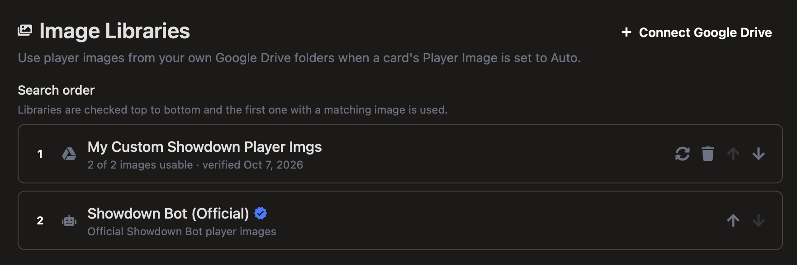
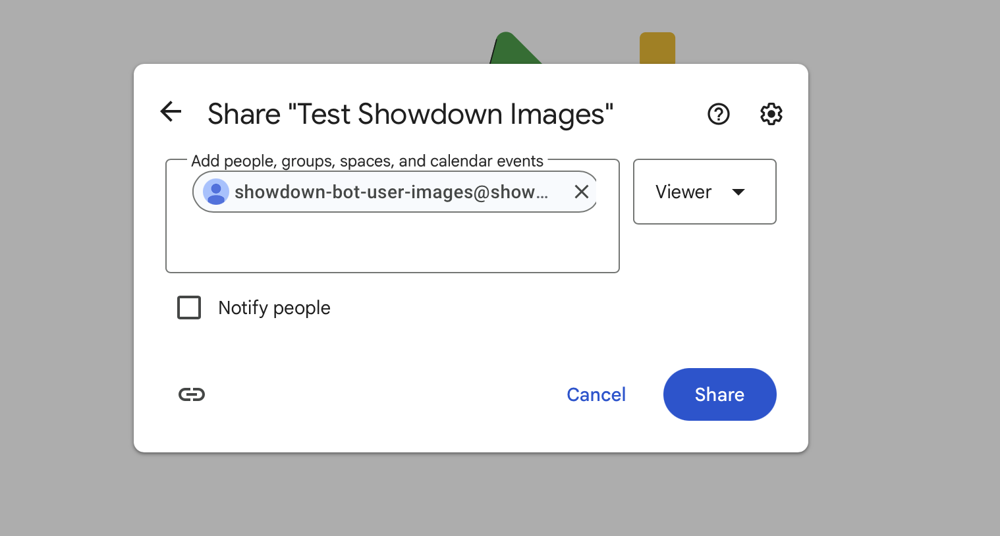
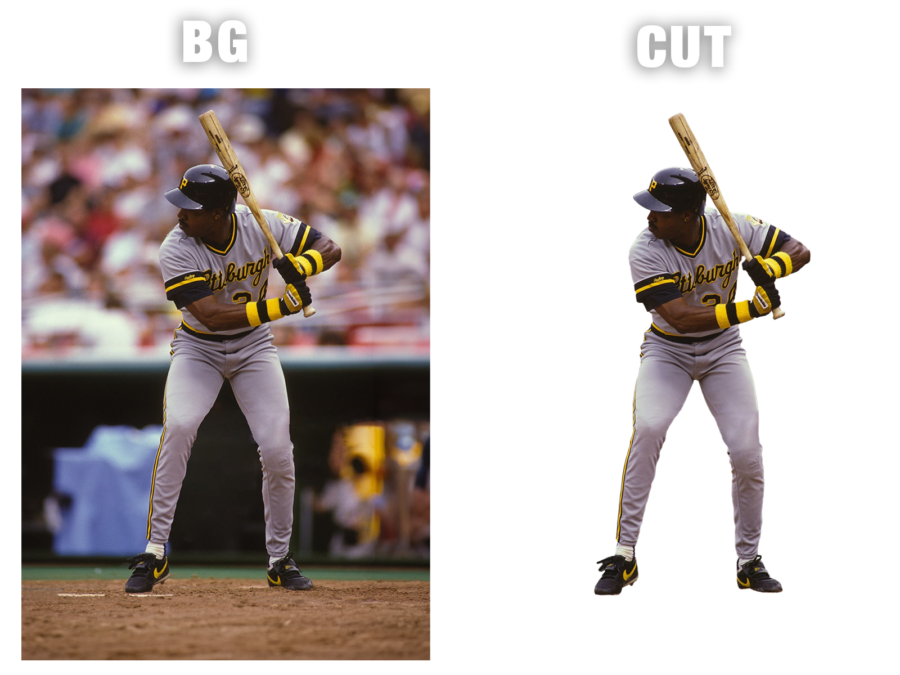
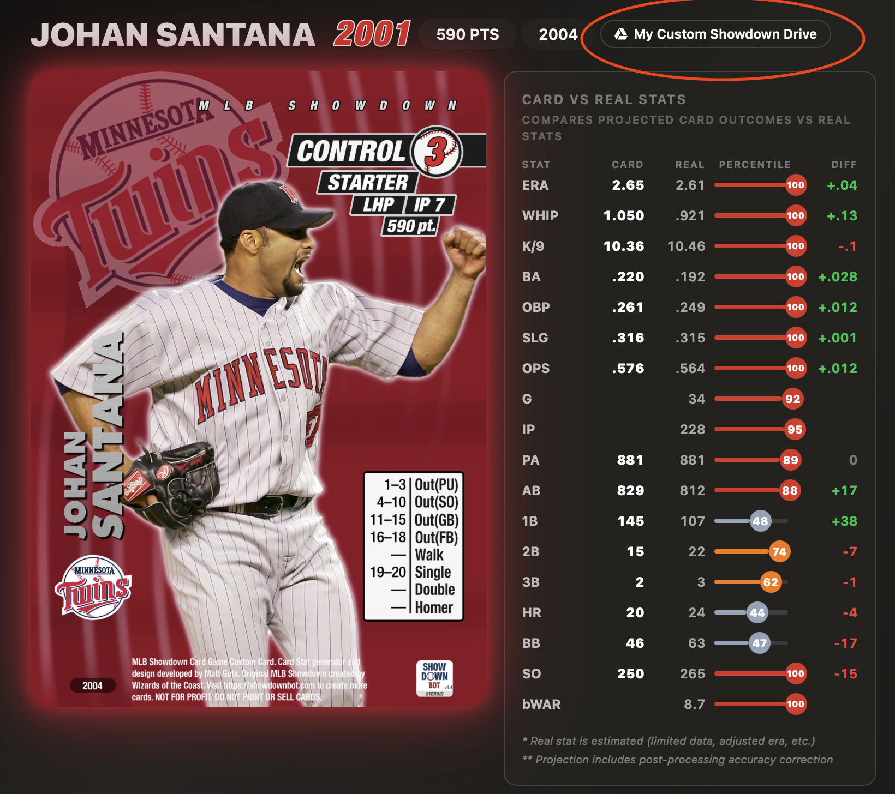
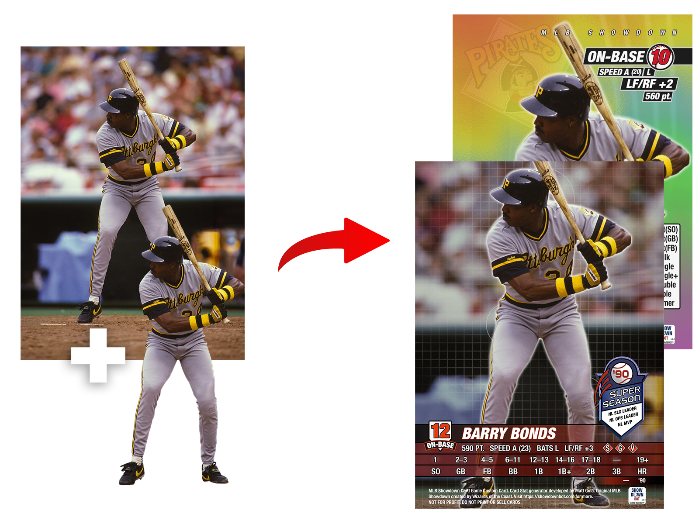
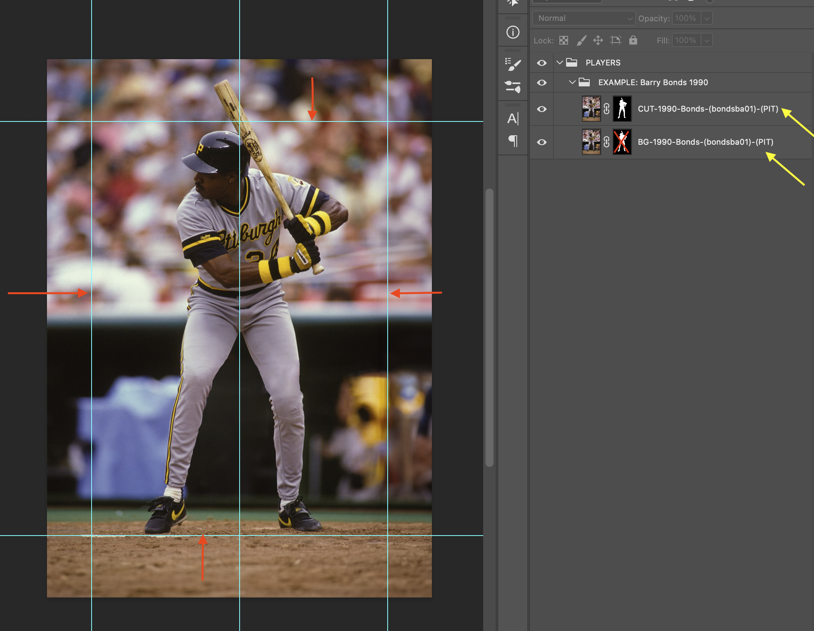

# Using Your Own Player Images (Google Drive Image Libraries)

Showdown Bot can use player images from your own Google Drive folder when a card's image is set to automatic.

## Why use an image library?

- **No more re-uploading.** Add an image to your folder once and it's used every time you build that player's card, on any device.
- **Automatic matching.** The bot finds the right player's image from the file name and picks the best one for the card's year, team, and set. No need to pick an image yourself.
- **Share with friends.** Once your folder is set up, anyone can connect it to their own account by pasting the folder link. Pool libraries with friends to cover as many players as possible.

## How this guide works

This guide has three parts. Most people only need the first two. If you want the best possible experience and best looking cards, I suggest learning the advanced image setup as well.

1. **[Setting up the integration](#1-setting-up-the-integration).** Connect a Google Drive folder to your Showdown Bot account. You only do this once.
2. **[Image setup (basic)](#2-image-setup-basic).** The minimum: make a `1500 x 2100` image, name it correctly, and put it in your folder.
3. **[Image setup (advanced)](#3-image-setup-advanced).** Optional but most useful to learn. Use the Photoshop template to make one image that Showdown Bot automatically positions for every set, the same way its own images work.

At the end there's a [troubleshooting](#troubleshooting) table if a card doesn't look right.

---

# 1. Setting up the integration

When you build a card with an automatic image, Showdown Bot checks your image libraries in the order you set on your **Account** page. The built-in Showdown Bot library is always on the list. The first library that has an image for the player is used, and the card shows which library it came from.



### Step 1: Create a folder

Create a folder in Google Drive. A personal Google account works best, because work and school accounts often block sharing outside the organization. Folders in Shared Drives work too.

### Step 2: Share it with Showdown Bot

1. Right-click the folder and choose **Share**.
2. Paste the bot's email (also shown on your [Account](https://www.showdownbot.com/account) page):
   `showdown-bot-user-images@showdown-bot-315820.iam.gserviceaccount.com`
3. Set the role to **Viewer**. Folders shared with edit access are rejected.
4. Uncheck **Notify people**, then click **Share**.



Showdown Bot can only see this one folder and can't change anything in it. To revoke access at any time, remove the bot's email from the folder's sharing settings.

### Step 3: Connect it

On your [Account](https://www.showdownbot.com/account) page, under **Image Libraries**, click **Connect Google Drive**. Paste the folder link, click **Test connection**, and save.

The test shows how many images it found and how many follow the naming format, with examples of any that don't so you can fix them. It's fine to connect an empty folder and add images later.

You can connect up to **5 folders** and use the arrows to set the order they're searched.

### Sharing your library with friends

To share your library, send a friend the folder link. They connect it on their own Account page the same way (Step 3). They don't need to share anything themselves, because the folder is already shared with Showdown Bot. A friend's library works the same way: paste their link and connect it.

Changes the owner makes to the folder show up for everyone who has it connected. If the owner removes the bot's access, the library stops working for everyone.

---

# 2. Image setup (basic)

This is all you need to get your own image on a card.

### Step 1: Make the image

| | |
|--|--|
| **Size** | `1500 x 2100` px (5:7 portrait, the same shape as the card) |
| **Format** | PNG (JPG works for `BG` images) |

The image is placed on the card **exactly as you made it**, on every set. What you see in your editor is what's on the card. Any editor works: Photoshop, Photopea (free, in the browser), GIMP, Affinity, Procreate, and others.

- **Bigger is fine** as long as the shape stays 5:7 (for example `3000 x 4200`). Smaller images get scaled up and can look blurry.
- Other shapes are center-cropped to fit.
- On **bordered** cards, a `1500 x 2100` image sits inside the border. Use `1644 x 2244` if you want it to run under the border too.

### Step 2: Pick the image type

There are two image types:

| Type | What it is | Format |
|------|------------|--------|
| `BG` | The full photo: player **and** background, edge to edge. | PNG or JPG |
| `CUT` | Only the player, cut out, on a **transparent** background. No glow or shadow (the bot adds that). | PNG with transparency |



Each set needs different types. If the card needs a type you don't have, the bot skips your library and uses the next one.

| Set | Standard cards | Special editions and parallels |
|-----|----------------|--------------------------------|
| 2000, 2001 | `CUT` | `CUT` |
| 2002, 2003, 2004, 2005 | `BG` | `BG` + `CUT` |
| Classic, Expanded | `BG` + `CUT` | `BG` + `CUT` |

Special editions include Super Season and Cooperstown Collection. Parallels include Rainbow Foil, Gold, and Moonlight.

> **Simplest start:** a single `BG` works for standard 2002–2005 cards. Add a matching `CUT` (same size, same position) to cover every set and option.

### Step 3: Name the file

The file name is how the bot matches an image to a player, **so it has to follow this format exactly**:

```
{TYPE}-{YEAR}-{NAME}-({PLAYER ID})-({TEAM}).png
```

For example:

```
BG-2001-Bonds-(bondsba01)-(SFG).png
CUT-2001-Bonds-(bondsba01)-(SFG).png
```

| Part | Required | Rules |
|------|----------|-------|
| `TYPE` | Yes | `BG` or `CUT`, in capital letters. |
| `YEAR` | Yes | A single 4-digit season, like `2001` (not a range). If you have several images of a player, the closest year wins. |
| `NAME` | Yes | Anything you like. It's just for keeping your folder organized. |
| `(PLAYER ID)` | **Yes** | Must be exact, in parentheses. Use the Baseball Reference ID (`bondsba01`, from `baseball-reference.com/players/b/bondsba01.shtml`) or the MLB ID (`111188`, from `mlb.com/player/barry-bonds-111188`). |
| `(TEAM)` | Recommended | The **Baseball Reference** team abbreviation, like `SFG` (not `SF`), from team page links like `baseball-reference.com/teams/SFG/2001.shtml`. |

There are also optional tags for dark mode, postseason, and more. See [Optional tags](#optional-tags) in the advanced section.

### Step 4: Upload it

Upload the image **directly into your connected folder**. Images in subfolders aren't searched. New and replaced files are picked up on the next card build.

### Step 5: Test a card

1. Open the **Custom Card Builder**.
2. Enter the player and the year that matches your image.
3. Leave the image on the automatic setting (don't upload an image or paste a link).
4. Build the card. The image source badge should show your library's name.



---

# 3. Image setup (advanced)

A basic `1500 x 2100` image is shown exactly as you made it, so it looks the same on every set. Showdown Bot's own images work differently: they're a little bigger than the card, and each set crops, zooms, and shifts them to fit its design. For example, 2001 zooms in on the player's upper body, while 2004 shows the whole photo.

Your images can work the same way if you make them at **exactly** `1950 x 2730` px, with the player framed a certain way. The Photoshop template does most of the setup for you.



### The template

Download [`templates/ShowdownBotPlayerImageTemplate.psd`](templates/ShowdownBotPlayerImageTemplate.psd). It opens in Photoshop, Photopea and some other editors and includes:

- A `1950 x 2730` canvas.
- Guides marking the `1500 x 2100` card area (red arrows below).
- An example player group with `BG` and `CUT` layers set up (yellow arrows below).



To make a new player, create a new folder next to the Bonds example and follow the steps below.

> **Important:** The auto-positioning only happens at **exactly** `1950 x 2730`. Any other size is shown as is, bleed and all, so the player looks zoomed out. If you worked at a larger size, resize to exactly `1950 x 2730` before exporting.

<details>
<summary>Not using Photoshop? Set up the guides yourself</summary>

Make a `1950 x 2730` canvas and add:

- Vertical guides at x `225` and x `1725`.
- Horizontal guides at y `315` and y `2415`.
- A center guide at x `975`.

</details>

### Step 1: Frame the player

Every set's crop is built around this framing, so stick to it:

- **Head:** just inside the **top** guide, centered on the middle guide.
- **Feet:** on the **bottom** guide.
- **Body:** centered left to right, inside the side guides.

> **Don't see the guides?** Photoshop may have them hidden. Turn them on with **View > Show > Guides** (`Ctrl+;` on Windows, `Cmd+;` on Mac). If they're still missing, make sure **View > Extras** is checked too.

Some sets crop the lower legs on purpose, so don't shrink the player to fit every set. Everything outside the guides is bleed: keep the photo running all the way to the canvas edge, so sets that show part of the bleed get real background instead of empty space.

<details>
<summary>Reference: what each set shows of a 1950 x 2730 image</summary>

On a standard (non-bordered) card:

| Set | Visible window (x) | Visible window (y) |
|-----|--------------------|--------------------|
| 2000 | `200`–`1700` | `15`–`2115` |
| 2001 | `340`–`1540` | `65`–`1745` |
| 2002 | `397`–`1703` | `201`–`2029` |
| 2003 | `397`–`1703` | `301`–`2129` |
| 2004, 2005 | `225`–`1725` | `315`–`2415` |
| Classic, Expanded | `375`–`1575` | `315`–`1995` |

Special editions (like WBC and All-Star) shift the image further.

</details>

### Step 2: Edit the BG layer

1. **Start with a high-resolution photo.** Portrait photos work best.
2. **Fill the whole canvas.** A `BG` must reach every edge with no transparent or blank areas. Generative or content-aware fill can help extend a background.
3. **Clean up** anything distracting: watermarks, stray logos, or busy areas behind where the name and chart will sit.
4. **Color-correct as you like.** Some parallels and special editions change the color or saturation on top of your image.

### Step 3: Edit the CUT layer

In the template, the `CUT` is the same photo layer as the `BG`, with a layer mask that shows only the player. The `BG` uses the same mask **turned off** (Shift-click the mask thumbnail to toggle it). This keeps the two lined up pixel for pixel, which matters on Classic and Expanded where the `CUT` sits right on top of the `BG`.

1. **Don't move or resize the player** between the two layers. Any shift shows up as a double outline.
2. **Select the player** with your editor's subject-selection tool, then refine the edge. Watch hair, cap brims, gloves, and the bat.
3. **Mask out everything else** so it's fully transparent.
4. **Clean the edges:** remove halos of the old background color, delete stray specks and partly transparent pixels (the bot's glow outlines anything that isn't fully transparent), and fill any holes inside the player.
5. **Don't add your own glow, shadow, or outline.** The bot adds these to match the set.

### Step 4: Export

Name each layer after the file it exports to, like `BG-1990-Bonds-(bondsba01)-(PIT)` and `CUT-1990-Bonds-(bondsba01)-(PIT)`. Photoshop's layer export options use the layer name as the file name.

| | BG | CUT |
|--|----|-----|
| Format | PNG (best) or JPG | **PNG only** |
| Transparency | Not needed | **Required** |
| Size | Exactly `1950 x 2730` | Same as the BG |
| Color | sRGB | sRGB |

- Use high quality (90+) if you export a JPG.
- **Check that each file is still `1950 x 2730`.** Some export options trim transparent edges, which shrinks a `CUT` down to the player's outline. A trimmed `CUT` is treated as a basic image and won't line up with the `BG`.

Then upload and test as in the [basic section](#step-4-upload-it). Good sets to check are **2001** and **Classic** (most zoomed in and shifted) and **2004** (whole card area shows). Try a **Classic** card to confirm the `CUT` lines up with the `BG`.

### Optional tags

Add any of these in parentheses after the team to target certain cards:

| Tag | Use it for |
|-----|-----------|
| `(DARK)` | Dark mode cards |
| `(POST)` | Postseason cards. These images rank **lower** on regular-season cards. |
| `(HITTER)` / `(PITCHER)` | Two-way players, to pick the hitter or pitcher version |
| `(CC)`, `(SS)`, `(ASG)`, `(RS)`, `(HOL)`, `(PM)` | A certain edition: Cooperstown Collection, Super Season, All-Star Game, Rookie Season, Holiday, Promo |

For example: `BG-2023-Ohtani-(ohtansh01)-(LAA)-(PITCHER).png`

<details>
<summary>How the best image is picked when a player has several</summary>

Each file name of the needed type gets a score:

- **Team tag:** counts 2x.
- **Edition tag** matching the card's edition: counts 3x.
- **Year:** the exact year gets full credit; nearby years get partial credit.
- **`(DARK)` and `(HITTER)`/`(PITCHER)`:** add points when they match the card.
- **`(POST)` or a WBC tag** on a card that isn't postseason or WBC: points taken away.

The highest score wins. On a tie, the **shorter file name** wins.

</details>

---

# Troubleshooting

| Problem | Likely cause |
|---------|--------------|
| The card uses the Showdown Bot image (or a silhouette) instead of mine | The card needs an image type you don't have (see [the table](#step-2-pick-the-image-type)), the player ID is wrong, or the image is in a subfolder. |
| Works on 2004 but not on Classic, or not with a parallel | Only a `BG` was added. Classic, special editions, and parallels also need a `CUT`. |
| A file shows up as "doesn't match the naming format" | The type isn't capital `BG`/`CUT` at the start, the year has a dash in it, or the player ID isn't in parentheses. |
| The wrong image of the player gets picked | Add the `(TEAM)` tag, use the exact year, or add [optional tags](#optional-tags). `(POST)` images rank lower on regular-season cards. |
| Blurry image | The image is smaller than `1500 x 2100`. |
| Image doesn't reach the border on bordered cards | `1500 x 2100` images sit inside the border. Use `1644 x 2244` to fill it. |
| White or black box behind the player | The `CUT` was saved as a JPG or without transparency. |
| Glowing dots or a ring around the player | Stray partly transparent pixels or a halo left on the `CUT`. |
| Glow or shadow looks doubled | A glow or shadow was baked into the `CUT`. |
| Double outline on Classic or Expanded | The `CUT` doesn't line up with the `BG` (moved, resized, or trimmed on export). |
| Player looks zoomed out or small (advanced) | The bleed image isn't exactly `1950 x 2730`, so it's shown as is. |
| Head cut off or player too high/low on some sets (advanced) | The player isn't framed head-at-top-guide, feet-at-bottom-guide. |
| Guides don't show up in the template (advanced) | They're hidden. In Photoshop, turn on **View > Show > Guides** and **View > Extras**. |
| "Folder not found" when connecting | The folder isn't shared with the bot's email, or your work or school account blocks outside sharing. |
| "Shared with edit access" | Change the bot's role on the folder to **Viewer**. |
